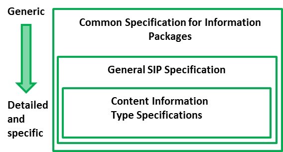

# 1. Introduction

## 1.1. Scope and purpose

This document is a core / general SIP specification which is guided by the following hierarchical model (see Figure 1):

- Common Specification for Information Packages (CSIP) identifies and standardises the common aspects of information packages (SIP/AIP/DIP) which are equally relevant and implemented by any of the functional entities of the overall digital preservation process (i.e. pre-ingest, ingest, long-term preservation and access). CSIP is a separate document. Therefore, the current specification does not aim largely repeating the information presented there – only the information that is absolutely necessary to understand the SIP specification will be mentioned here. 
- General SIP Specification. This is the current document which describes the SIP package structure and minimum set of required metadata for SIP delivery to the archive.
- Content Information Type Specifications are content-dependent specifications which include detailed information on how content, metadata, and documentation for specific content types (for example ERMS or relational databases) can to be handled within the SIP. At the moment, there are 3 such specifications:
	- SIARD 2.0 for relational databases (The SIARD 2.0 specification for relational databases can be found at http://eark-project.com/resources/specificationdocs/32-specification-for-siard-format-v20)
	- SMURF ERMS for electronic records management systems (The SMURF profile for ERMS can be found https://github.com/DLMArchivalStandardsBoard/SMURF/tree/master/spec.) 
	- SMURF SFSB for simple file system based records (The SMURF profile for SFSB can be found at https://github.com/DLMArchivalStandardsBoard/SMURF/tree/master/spec.) 

## 1.2.	Related work

This document is based on or influenced by the following documents and best practices: 

- **Deliverable D3.1** - E-ARK Report on Available Best Practices, 2014, http://eark-project.com/resources/project-deliverables/6-d31-e-ark-report-on-available-best-practices 
D3.1 was one of the inputs to the deliverable D3.2 and the D3.2 to the D3.3.
-  **Deliverable D2.1** - General pilot model and use case definition, 2014, http://eark-project.com/resources/project-deliverables/5-d21-e-ark-general-pilot-model-and-use-case-definition.
We have developed the SIP specification to support the workflows defined in the general model.
- **FGS package structure**,  2013, https://riksarkivet.se/Media/pdf-filer/Projekt/FGS_Earkiv_Paket.pdf 
This specification was one of the main inputs for the first draft SIP specification. The newest version (https://riksarkivet.se/Media/pdf-filer/doi-t/FGS_Paketstruktur_RAFGS1V1.pdf) was also investigated in the SIP definition process.
- **Reference Model for an Open Archival Information System** (OAIS), 2012, public.ccsds.org/publications/archive/650x0m2.pdf  
We have used the same terminology as introduced in the OAIS model and also the same division of information package types: Submission Information Package (SIP), Archival Information Package (AIP), Dissemination Information Package (DIP).
- **Producer-Archive Interface Methodology Abstract Standard** (PAIMAS), 2004,  public.ccsds.org/publications/archive/651x0m1.pdf
We have looked at the four phases (Preliminary, Formal Definition, Transfer, Validation) of PAIMAS, their aims and expected results and decided to support the phases as far as possible with the current specification. Furthermore, the requirements for the submission agreement were influenced by the PAIMAS standard.
- **Producer-Archive Interface Specification (PAIS)** – CCSDS, 2014, public.ccsds.org/publications/archive/651x1b1.pdf
We have investigated the structure of a SIP presented in PAIS, but as the implementation of this specification is far from comprehensive (only few prototypes exist), we decided to rely more on the best practices introduced in the best practice report.
- **e-SENS** (Electronic Simple European Networked Services) project, http://www.esens.eu/  
We have investigated the e-Delivery and e-Documents related work in e-SENS and made sure that our work is neither duplicating the work done there nor producing any conflicts between deliverables.
- **Deliverables D3.2** - E-ARK SIP Draft Specification, 2015, http://eark-project.com/resources/project-deliverables/17-d32-e-ark-sip-draft-specification and D3.3  E-ARK SIP Pilot Specification, 2016, http://eark-project.com/resources/project-deliverables/51-d33pilotspec 

