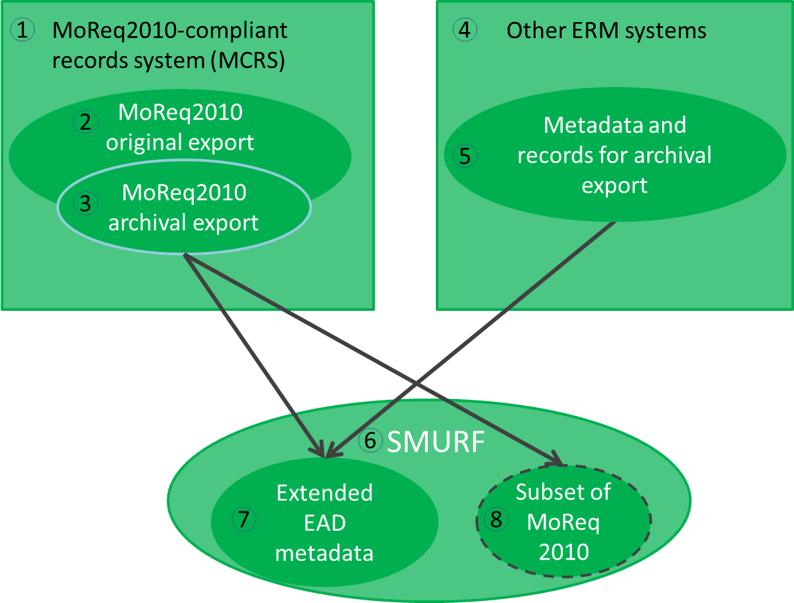
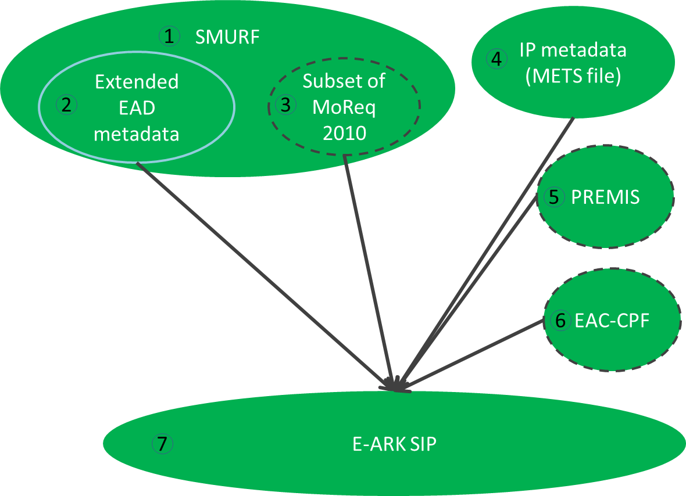
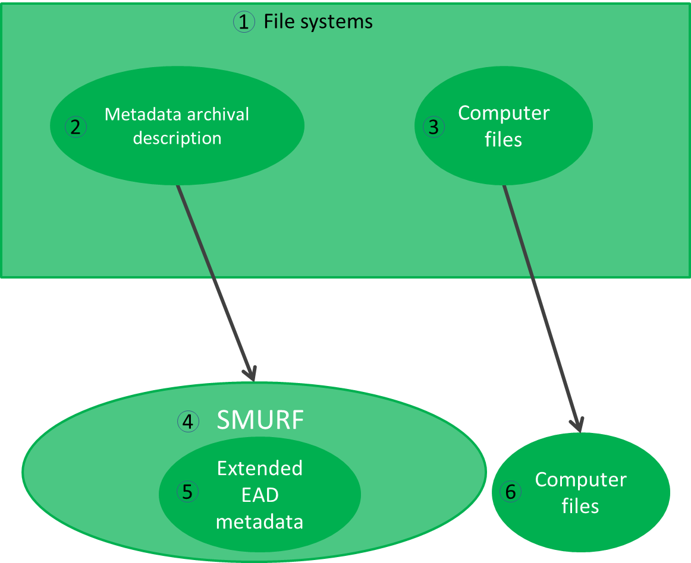
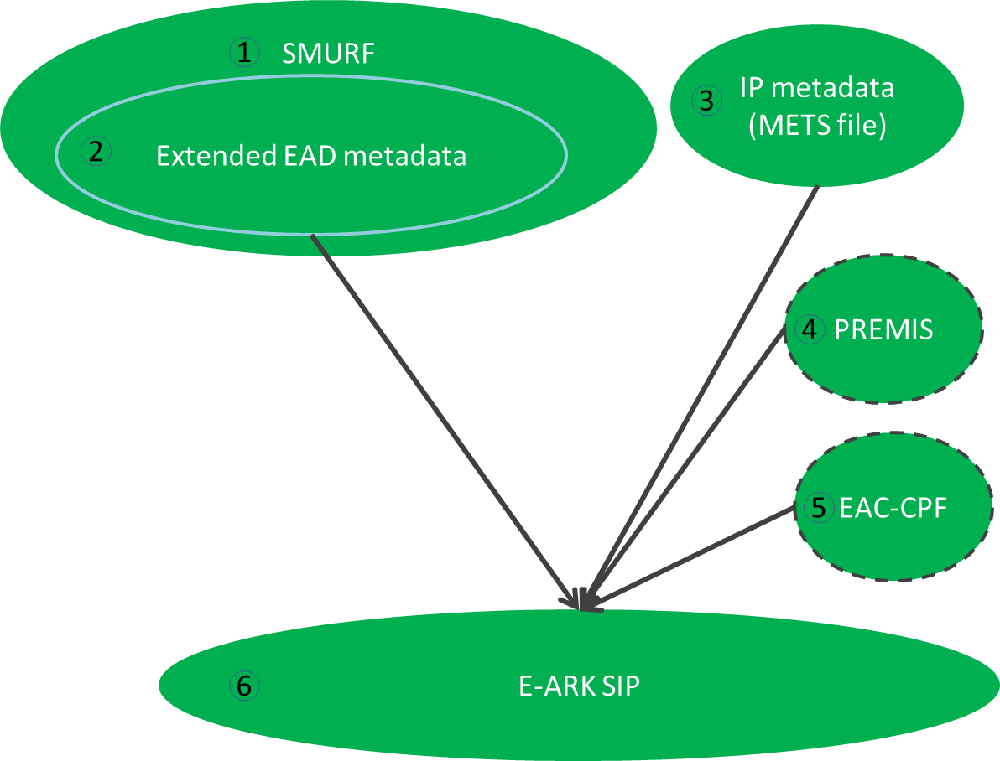
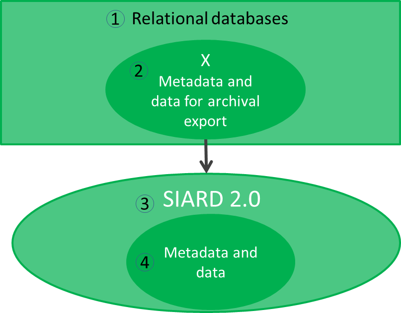
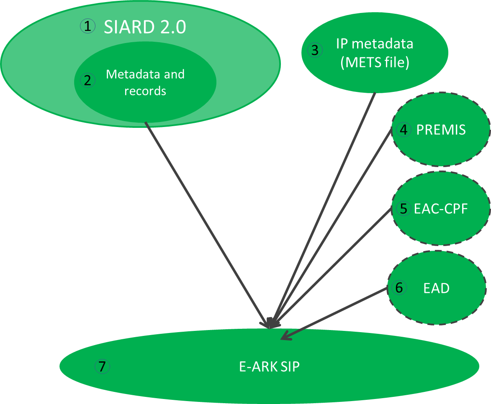
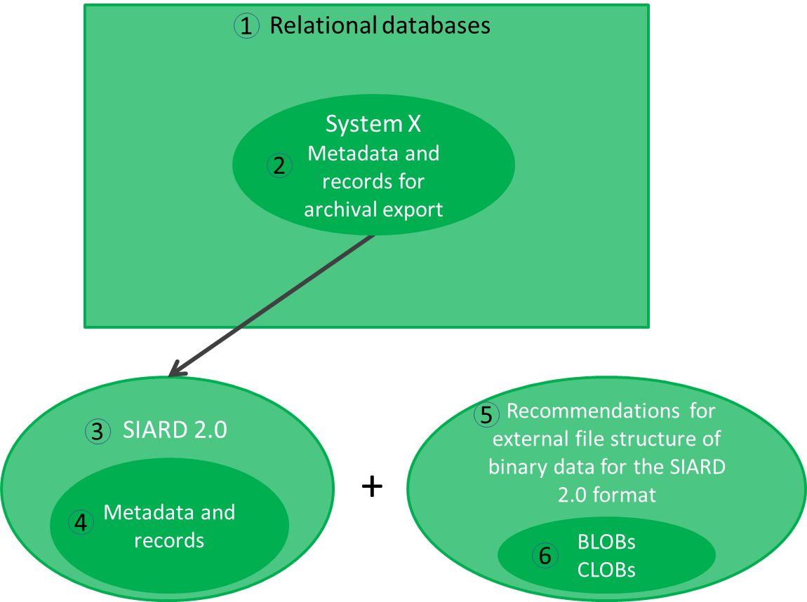

# 4.	CONTENT INFORMATION TYPE SPECIFICATIONS

As discussed above (Chapter 2), an SIP can include content-type specific data and metadata. Types of data files and their structural relationships, and metadata elements vary for different content-types. Metadata is submitted to an archive so that it can support functions in the archive. The metadata created by business systems can be in different structures / formats. The amount and type of available metadata depends very much on the type and owner/developer of the system. As such there are also differences in how much metadata can a specific system or type of system export and in which formats. To deal with these differences there’s the possibility of content type profiles which define detailed metadata requirements beyond the Common Specification for Information Packages and general SIP.
 
This specification does not offer one single structure in which the content-type specific metadata could be stored as a whole. In order to efficiently use the metadata to support archival functions the SIP defines separate SIP METS sections as containers for the various metadata functions, such as the METS header for package management function, the `<dmdSec>` for EAD metadata standard (i.e. using `<dmdSec>` for package discovery) and other descriptive metadata standards, the `<amdSec>` for preservation (PREMIS), technical and other functions and standards. In order to use the submitted metadata it has to be mapped to and referenced from the SIP METS sections.  To do this the content-type specific metadata elements need to be mapped to those containers and implemented in the agreed standards. Therefore, complementary metadata profiles are needed for content types. This document refers to 3 profiles which define how the submitted content-specific metadata should be mapped to the SIP structure: 

- The SMURF (semantically marked up record format) for ERMS will contain mappings for ERMS (electronic records management systems) based on MoReq2010 as described in 4.1.
- The SMURF for SFSB (simple file-system based) records as described in 4.2.
- The SIARD 2.0 profile for relational databases as described in a section 4.3.
All SIPs will need to be transformed into AIPs in the archival ingest process. The SIP to AIP conversion is described in the AIP specification. 

## 4.1.	Electronic records management systems (ERMS)

The first case represents ERMS records encapsulated in the SIP.  This profile aims to standardise the export of records management systems into a single easy to use model. The basic workflow is described on Figure 9.
 

In case of ERMS we distinguish two scenarios – MCRS and non-MCRS (1, 4). The latter is assumed to be able to export metadata and records in a native export format (5),  the first supports in addition the specific MoReq2010 export format (2). Further, the export for archival purposes can differ from the original export (3).

The SMURF ERMS profile (6) defines a set of Extended EAD metadata (7)  which are created during the pre-ingest phase. In some cases it may be not possible to map all relevant original elements to a set of Extended EAD metadata, therefore some MoReq 2010 elements (8) are allowed  for guaranteeing that all required elements are included in the SIP.

footnotes:

-  The scope of this chapter is to give short introductions; more details are available in a separate document SMURF (semantically marked up record format) for ERMS.
-  The metadata extracted from a non-MCRS system should be mapped and transformed into the SMURF format by using external mechanisms (i.e. XSL transformation) or by updating the export format to support the SMURF profile.
-  The EAD extraction will be created automatically  by a MCRS.
-  We do not recommend using MoReq2010 elements in the SMURF profile and therefore only the mapping from MoReq2010 elements to EAD will be provided.

The SMURF extraction should be complemented with more general information about the information package and could be complemented with PREMIS, EAC-CPF metadata as well (Figure 10).

The SMURF profile (1) includes MoReq2010 metadata that has been mapped to EAD (2) and some additional elements required by archives.  The structural metadata for the submission information package (represented as a METS file) will be added (4) during the SIP preparation process. If possible the EAC-CPF metadata (6) should be created and SIP creation events logged as PREMIS metadata (5). The full SIP will consist of items 1, 4 and optionally (5), (6).

 
## 4.2.	Simple file system based records (SFSB) 

The second case represents an encapsulation of computer files into the SIP. It is based on an assumption that the files can be described in an extended EAD format  (Figure 11).
 

The blocks in the diagram refer to the following. Computer files reside in some file system (e.g. shared drives, 3). The metadata (2) about the files needed for the long time preservation may or may not exist. If the metadata exists then it has to be transformed into the EAD metadata (5). If the metadata does not exist then it has to be created and included in the SIP.

The SMURF metadata should be complemented with more general information about the information package and could be complemented with PREMIS, EAC-CPF metadata as well to build a full SIP (Figure 12).

 

The blocks in the diagram refer to the following:

1.	The SMURF profile for SFSB records.
2.	Archival descriptions following the EAD extended schema for SFSB records. 
3.	Structural metadata for the submission information package (represented as METS file).
4.	If possible then SIP creation events should be logged as PREMIS metadata.
5.	If possible then EAC-CPF metadata should be created during the SIP creation process.
6.	The SIP consists of items 1, 3 and optionally (4), (5).
 
## 4.3.	Relational databases 

The third case represents a relational database encapsulated in the SIP. This case structure presumes that the database is previously exported in the SIARD 2.0 format (a harmonised format for database archiving based on SIARD, Figure 13). 
 

Various relational databases (e.g. Oracle, PostgreSQL, etc.) exist (1). These databases contain the metadata and records in its native format (2) which can be extracted into a standardised format (4) by following SIARD 2.0 (3). The SIARD extraction should be complemented with more general information about the information package and could be complemented with PREMIS, EAC-CPF, EAD metadata as well (Figure 14).
 

 
### BLOBs and CLOBs in relational databases 

The Figure 13 and Figure 14 show the most common profile for relational databases with metadata and records. However, in some cases there can be binary data in a relational database which will be exported as external files in SIP creation. This might cause a situation where it is necessary to consult with “RECOMMENDATION for storing large objects outside the SIARD file”, which is a specific and technical recommendation that is not included in the SIARD 2.0 specification.

Binary data in regard to relational databases is defined as information which is stored in the database as a bit stream following a specific file format. The potentially huge size of binary data within a database can lead to problems in the handling and archival processing of the database.  Binary data is mostly referred to as binary large object (BLOB). Similarly large amounts of character data are named CLOB. CLOBs pose a problem due to size more than lack of a proper data type. For the rest of this section CLOBs will be treated as BLOBs.

An example of a relational database with BLOBs could be a database where images are stored.

Databases and the handling of binary data has always been a challenge, regardless of whether the handling was based on: 

1.	Internal BLOBs - where data is contained in the records.
2.	External direct references (path and filename) – where BLOBs are stored as files.
3.	External indirect reference (file ID)-  where BLOBs are stored as files.
4.	Other methods which may exist.

The first method using internal BLOBs is supported in the SIARD 2.0 format, but if a table contains data with BLOBs that are more than 2000 bytes or 2000 characters in size, BLOBs will be produced as separate files and a reference to the location of the individual files stored in the cell content. The SIARD 2.0 format therefore also supports external reference to BLOBs stored as files inside the SIARD table folder structure (i.e. inside the SIARD ZIP package file).

The above scenario will therefore have no consequences regarding the Figure 13 and Figure 14 presented above. 

The SIARD 2.0 format, however, also supports methods using external files outside the SIARD table folder structure (i.e. outside the SIARD ZIP package file) but it does not describe in detail how to handle BLOBs if this is the case. It is in this particular scenario that it is advisable to consult the detailed recommendations in “RECOMMENDATION for storing large objects outside the SIARD file” document.  

When a SIP creation includes BLOBs stored as external files outside the table folder structure this will have influence on the SIP package since in this case there is not only one SIARD-file containing data from the database, but a SIARD-file and one or several other folders containing the external BLOB files. 

A diagram for external files outside the SIARD table folder structure is presented in Figure 15:
 

 
1.	Various relational databases (e.g. Oracle, PostgreSQL, etc.).
2.	The metadata and records in a relational database.
3.	The SIARD 2.0 specification.
4.	The metadata and records in the SIARD 2.0 format.
5.	Recommendations for external file structure of binary data for the SIARD 2.0 format. 
6.	BLOBs and/or CLOBs stored as external files outside the table structure.

### External BLOBs influence on METS file

If there are several data files and folders in the SIP package, this consequently has influence on the IP metadata (METS file). Therefore, “RECOMMENDATION for segmenting  IP using METS” describes how to represent the files in METS.  

Further information can be found in the SIARD 2.0 Profile document. 

