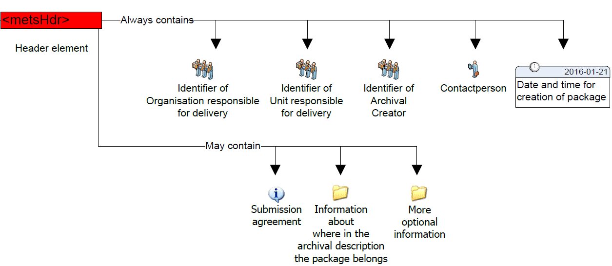
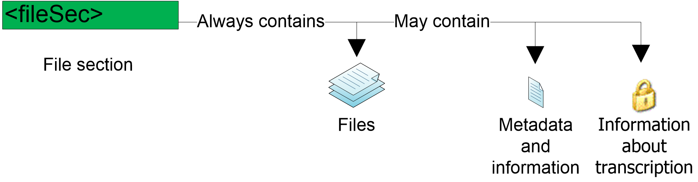
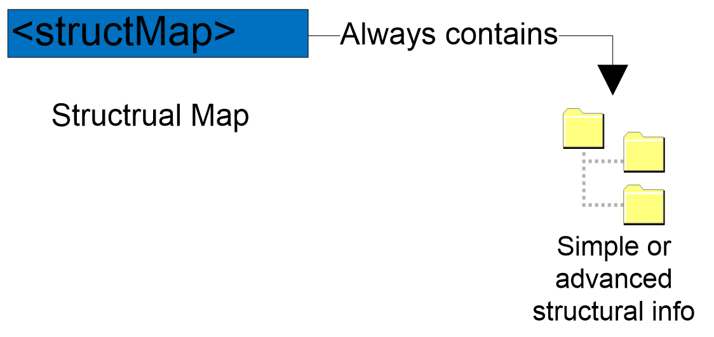
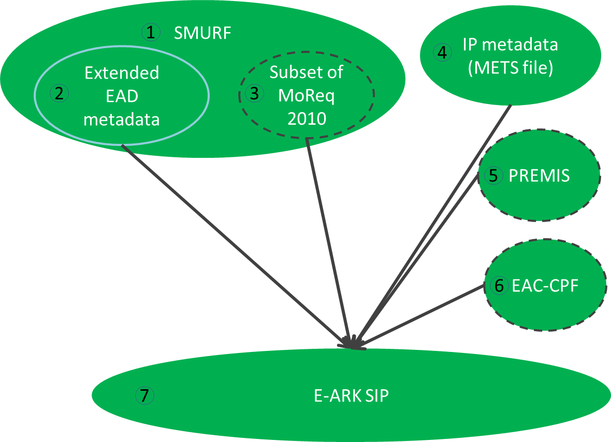
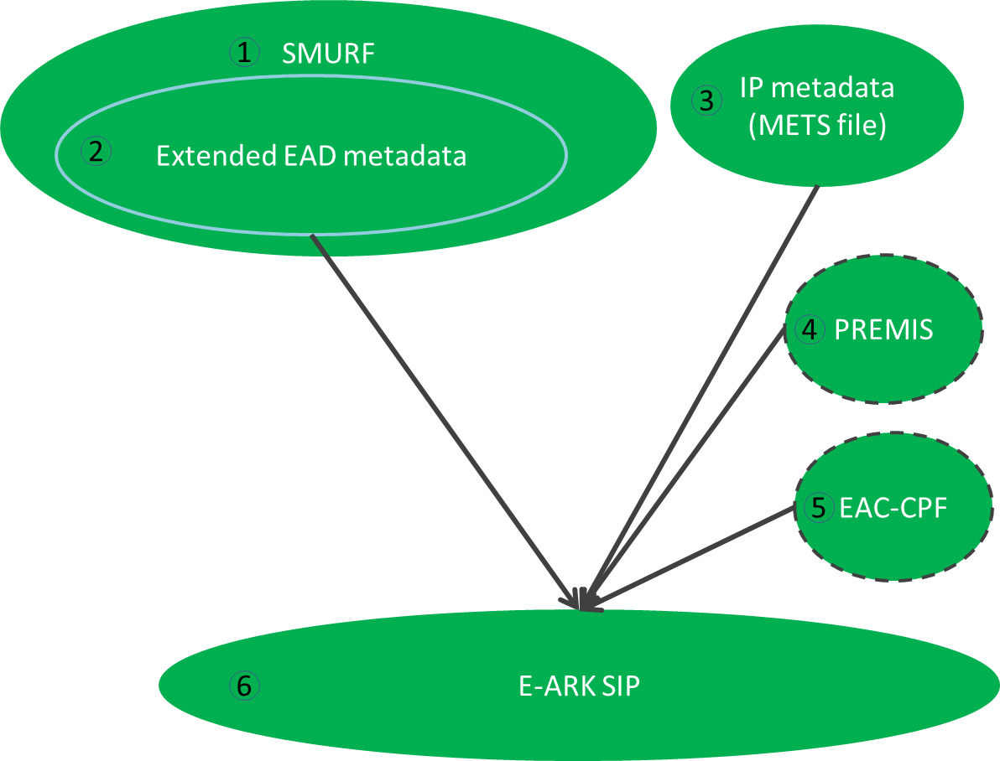
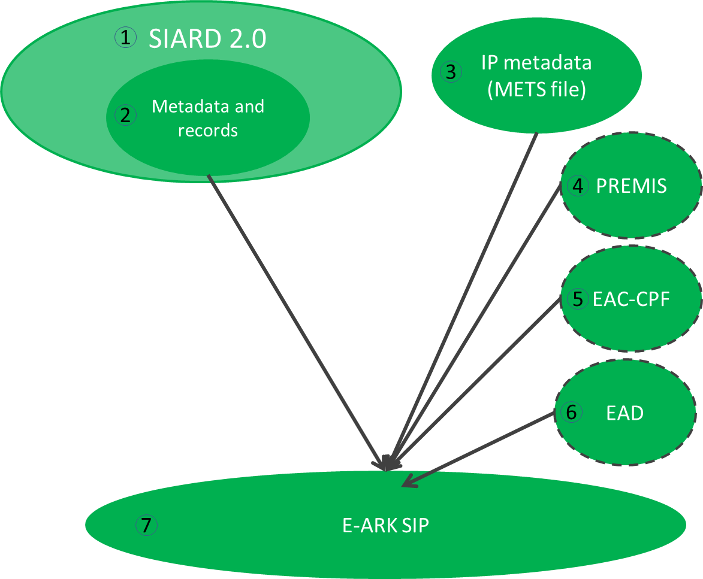
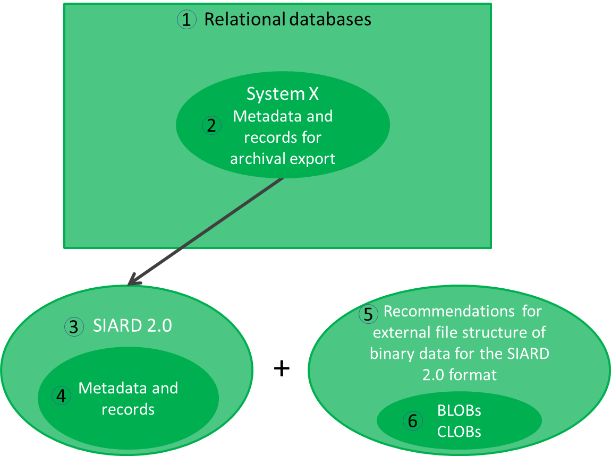

# GENERAL SIP SPECIFICATION

Version: 2.0.0-DRAFT

December 20, 2018

## Front matter

* Authors
* Reviewers
* Revision history and statement of originality
* Executive summary

## Indexes

* Table of contents
* List of tables
* List of figures


## Acknowledgements

The DILCIS BOARD and the authors of this specification would like to thank all national archives, tool developers, and other contributors who provided valuable knowledge about their submission information packages. 

A special gratitude goes to the National Archives of Sweden whose FGS (Förvaltningsgemensam Specifikation) structure influenced the first version of the SIP METS profile.

The authors would also like to express their gratitude to the team behind the Common Specification for Information Packages for their enormous effort in agreeing common principles for submission, archival and dissemination packages.


## Contact & Feedback

The General SIP Specification is maintained by the Digital Information LifeCycle Interoperability Standard Board (DILCIS Board). For further information about the DILCIS Board or feedback on the current document please consult the website http://www.dilcis.eu/ or contact us at
<dasboard@dlmforum.eu.>

## Introduction

According to the Open Archival Information System Reference Model (OAIS) every submission of information to an archive occurs as one or more discrete transmissions of Submission Information Packages (SIP). Unfortunately, the OAIS itself does not specify how these information packages should look like. 

The EU funded E-ARK project (2014-2017) first acknowledged this problem and developed a solution in the form of a Format Specification. This specification is now part of a set of specifications currently managed by an independent body called the Digital Information LifeCycle Interoperability Standards Board ([DILCIS Board](http://www.dilcis.eu)).

### Scope and purpose 

This documents describes the correct way of producing and parsing E-ARK compatible Submission Information Packages (SIP). The key objectives of the E-ARK SIP specification are:

* To define a generic structure of the SIP format in a way that it is suitable for a wide variety of archival scenarios, such as document and image collections, databases or geographical data.
* To recommend best practices regarding metadata, content and structure of SIPs.

### Target audience

The target group for this specification are record creators, archival institutions and software providers that work on either ends of the interactions between Producers and Archives.

### Relations to other E-ARK specifications

This document is part of a set of specifications that aim at defining a common understanding of the principles and requirements for interoperable Information Packages according to the OAIS reference model (see Figure).

The Common Specification for Information Packages (CS IP) identifies and standardises the common aspects of all information packages (Submission, Archival and Dissemination Information Packages, i.e. SIP, AIP and DIP, respectively) which are equally relevant and implemented by any of the functional entities of the overall digital preservation process (i.e. pre-ingest, ingest, long-term preservation and access). CS IP is a separate document. Therefore, the current specification does not aim largely repeating the information presented there – only the information that is absolutely necessary to understand the SIP specification will be mentioned here.


In general, the E-ARK SIP specification reuses and applies fully all the requirements laid out in the CS IP. However, it extends it with aspects that are solely relevant to the process of transmitting and ingesting submission information into an archival environment. For example, the E-ARK SIP specification extends the CS IP with further requirements about recording relevant information on a submission agreement and information about the actors involved in the submission process.  

An additional concept is also part of the set of specifications. That is the Content Information Type Specifications. These are content-dependent specifications which include detailed information on how content, metadata, and documentation for specific content types can to be handled within the SIP. At the moment, there are 3 such specifications:

* E-ARK ERMS: Content Information Type Specification for Electronic Records Management Systems. 
* E-ARK Geodata: Content Information Type specification for geospatial information;
* E-ARK SIARD (SIARD1, SIARD2 and SIARDDK): Content Information Type specification for the archiving, preservation and reuse of relational databases.

For more information on Content Information Type specifications, please refer to the Common Specification for Information Packages.


### Definition of a SIP

The OAIS reference model defines a SIP as:

> An Information Package that is delivered by the Producer to the OAIS for use in the construction or update of one or more AIPs and/or the associated Descriptive Information. 

The E-ARK SIP follows this definition and builds on top of the E-ARK Common Specification for Information Packages by extending it to support specific requirements related to the process of selecting, packaging, transmitting, receiving and ingesting information originally maintained by a Producer. In summary, it constitutes a package of information that is ready to be sent by a Producer and ingested by an OAIS.

### Related work

This document is based on or influenced by the following documents and best practices:

* E-ARK Deliverable D3.1 - Report on Available Best Practices, 2014, [http://eark-project.com/resources/project-deliverables/6-d31-e-ark-report-on-available-best-practices](http://eark-project.com/resources/project-deliverables/6-d31-e-ark-report-on-available-best-practices)
* E-ARK Deliverable D2.1 - General pilot model and use case definition, 2014, [http://eark-project.com/resources/project-deliverables/5-d21-e-ark-general-pilot-model-and-use-case-definition](http://eark-project.com/resources/project-deliverables/5-d21-e-ark-general-pilot-model-and-use-case-definition)
* FGS package structure,  2013, [https://riksarkivet.se/Media/pdf-filer/Projekt/FGS_Earkiv_Paket.pdf](https://riksarkivet.se/Media/pdf-filer/Projekt/FGS_Earkiv_Paket.pdf )
* Reference Model for an Open Archival Information System (OAIS), 2012, [http://public.ccsds.org/publications/archive/650x0m2.pdf](http://public.ccsds.org/publications/archive/650x0m2.pdf )  
* Producer-Archive Interface Methodology Abstract Standard (PAIMAS), 2004, [http://public.ccsds.org/publications/archive/651x0m1.pdf](http://public.ccsds.org/publications/archive/651x0m1.pdf)
* Producer-Archive Interface Specification (PAIS) – CCSDS, 2014, [http://public.ccsds.org/publications/archive/651x1b1.pdf](http://public.ccsds.org/publications/archive/651x1b1.pdf)
* e-SENS (Electronic Simple European Networked Services) project, [http://www.esens.eu/](http://www.esens.eu/ )
* E-ARK Deliverable D3.2  - SIP Draft Specification, 2015, [http://eark-project.com/resources/project-deliverables/17-d32-e-ark-sip-draft-specification](http://eark-project.com/resources/project-deliverables/17-d32-e-ark-sip-draft-specification)
* E-ARK Deliverable D3.3 - E-ARK SIP Pilot Specification, 2016, [http://eark-project.com/resources/project-deliverables/51-d33pilotspec](http://eark-project.com/resources/project-deliverables/51-d33pilotspec)

## Structure

The SIP specification follows a general structure common to all information packages in the E-ARK set of specifications.  

The SIP data model describes the package submitted to the archive, which consists of representations (submitted data and metadata) and metadata as seen in Figure 2 (This is a conceptual model and does not describe the actual implementation structure.) and mandated/required by the SIP, AIP and DIP formats.  


As one SIP can contain more than one representation (Digital Object or physical object instantiating or embodying an Intellectual Entity. A Representation that is a Digital Object is the set of stored Files and Structural Metadata needed to provide a complete rendition of the Intellectual Entity. PREMIS Data Dictionary (full document), Version 3.0, 2015, http://www.loc.gov/standards/premis/v3/premis-3-0-final.pdf) of the same intellectual entity then it is reasonable to separate different representations (e.g. Rep-001 and Rep-002 under Representations). This requires additional metadata about the SIP. If we store all metadata (even about representations) at the IP level then we do not need to use the Metadata folder at the representation level. In this case, the Metadata directory under representations is considered optional, as are:

- Documentation folder – for including additional documents that explain the content or its use (e.g. user manual).
- Schemas folder – for adding schemas for the XML files in the data/metadata directly into the package.


If needed, a METS.xml file can be present under representations as well to handle scalability issues. This proposed extended IP structure using divided METS files, is introduced in the Common Specification for Information Packages and in deliverable D4.3 E-ARK AIP pilot specification (E-ARK AIP pilot specification, released January 2016, http://eark-project.com/resources/project-deliverables)  to more easily manage the splitting of large packages using a divided METS structure.

The detailed folder structure of a SIP will also be present and agreed upon in the submission agreement (page 41) by indicating the data model for the submission. Also the details of the internal structure of the data and metadata folders can be further specified in submission agreements.

The metadata model for the SIP will be multi-layered by starting from general common metadata elements and finishing with optional local elements as explained previously (Please note that the business specific (e.g. healthcare records) or local implementation based metadata is not discussed in this specification. As the specifications can be undertaken at different scales, with different types of data and locations, with their constituent technical components, more detailed or localised specifications may be needed.).  

## Metadata

The general SIP metadata is based on the METS standard and presented as a profile. METS profiles are intended to describe a class of METS documents in sufficient detail to provide both document authors and programmers with the guidance they need to create and process METS documents conforming to a particular [profile](http://www.loc.gov/standards/mets/mets-profiles.html).  

Creating a METS profile requires a good understanding of the METS Profile components. An overview of these components can be found in the [METS online documentation](http://www.loc.gov/standards/mets/profile_docs/components.html) and in Appendix D on page 44 in the [D3.2 specification](http://eark-project.com/resources/project-deliverables/17-d32-e-ark-sip-draft-specification). 

There are 5 main sections in this METS profile:

- ```<metsHdr>``` - METS header (metadata about the creator, contact persons, etc. of the IP).
- ```<dmdSec>``` - descriptive metadata (references to EAD, EAC-CPF, etc.).
- ```<amdSec>``` - administrative metadata (information about how files were created and stored, intellectual property rights, etc.).
- ```<fileSec>``` - file section, lists all files containing content (may also contain metadata about files).
- ```<structMap>``` - structural map, describes the hierarchical structure of the digital object and the whole IP (i.e. object + metadata). 

These sections will be described in more detail in sections 3.1 to 3.6. All these sections present the SIP requirements for METS elements in table form according to the following structure:

- Element - The name of the element in plain text used in the accompanying schema for elements or attributes. For more information regarding elements and attributes in XML see WWW Consortium (http://www.w3.org/).
- Definition - Defines the functions of the element. Contains an explanation of the element and some example values.
- Cardinality – Represents the number of occurrences of an element (see below).
	- 0..1 – The element is optional and cannot be repeated.
	- 0..* – The element is optional and can be repeated.
	- 1 – The element is mandatory and can only be stated once.
	- 1..* – The element is mandatory and has one or more occurrences.
- METS - Defines the element in the METS standard used for designing the SIP element. The column uses XML-syntax. [  ] defines where the value is placed.

### Root

The root of a METS document can contain a number of optional attributes, namespaces (xmlns:) and schema instance locations (xsi:) of the external standards referenced in the METS record and a number of other elements as seen in Table 1.

[Table 1 missing]

Example:

```xml
<mets 
  xmlns:xsi="http://www.w3.org/2001/XMLSchema-instance"
  xmlns:xlink="http://www.w3.org/1999/xlink" 
  xmlns="http://www.loc.gov/METS/" 

  PROFILE="http://www.dasboard.eu/specifications/sip/v03/METS.xml" 
  TYPE="ERMS" 
  OBJID="5d378f86-28a1-41d8-a2b9-264b10fbd511"  
  CONTENTTYPESPECIFICATION="SMURFERMS" 
  LABEL="METS file describing the SIP." 
  
  xsi:schemaLocation="http://www.loc.gov/METS/ schemas/METS.xsd http://www.w3.org/1999/xlink schemas/xlink.xsd"
  >
```


### Header

The METS header element <metsHdr> describes metadata about the creator, contact persons, etc. of the submission information package as seen in Figure 4.

 

These are the elements that give information about the submission of the SIP in the METS header element.

[Table 2: Metadata about the information package missing]


Example:

```xml
  <metsHdr CREATEDATE="2016-01-15T10:40:09" RECORDSTATUS="NEW" PACKAGETYPE="SIP">
    <agent TYPE="ARCHIVIST" ROLE="ORGANIZATION">
      <name>The Hungarian Ministry of Healthcare</name>
      <note>ORG:HU121345098701</note>
    </agent>
    <agent TYPE="CREATOR" ROLE="ORGANIZATION">
      <name> The Hungarian Health Agency</name>
      <note>ORG:HU891345098701</note>
    </agent>
    <agent TYPE="PRESERVATION" ROLE="ORGANIZATION">
      <name> National Archives of Hungary</name>
      <note>ORG:HU2010340987</note>
    </agent>
    <agent TYPE="OTHER" ROLE="CREATOR" OTHERTYPE="SOFTWARE">
      <name>SIP Creator</name>
      <note>VERSION=0.0.2</note>
    </agent>
  </metsHdr>
```

### Descriptive metadata 

The METS descriptive metadata element <dmdSec> references to archival description metadata (EAD, EAC-CPF, etc.) as seen in Figure 5.

 

Archival information can be included in the METS package. Usually, for the archival institutions this information is delivered in EAD and EAC-CPF formats.

To include EAD and EAC-CPF in a METS profile the use of <dmdSec> is to be preferred according to the METS implementation guide referenced above. The complete rules for all elements and attributes in the <dmdSec> are stated in the profile, the specific elements used when referencing and embedding is shown below.

Other metadata standards for description and administrative purposes can be used and referencing them must adhere to the <amdSec> and <dmdSec> rules stated in the profile. 

[Table 3: EAD metadata missing]

Example:

```xml
<dmdSec ID="ca14390a-6732-45ba-a466-3c32b7bbacd3">
     <mdRef ID="a9769e81-900a-466c-aee2-86249642532b" 
            LOCTYPE="URL" 
            MDTYPE="EAD" 
            MDTYPEVERSION="3" 
            xlink:type="simple" 
            xlink:href="file://metadata/descriptive/ead.xml" 
            MIMETYPE="text/xml" 
            SIZE="4700" 
            CREATED="2017-01-31T10:22:02.1202592+02:00" 
     		CHECKSUM="ee673e7c9f787a02f4ce30c553e781ac065487c3c9c16ac6381b51e2059f8cf2" 
     		CHECKSUMTYPE="SHA-256" />
</dmdSec>

<dmdSec ID="c9adf006-2383-4e8a-830c-506e47db2188">
     <mdRef ID="b9520eb0-4b1b-4c4f-8c9d-d0677eb2618a" 
            LOCTYPE="URL" 
            MDTYPE="EAC-CPF" 
            MDTYPEVERSION="2010" 
            xlink:type="simple" 
            xlink:href="file://metadata/descriptive/eaccpf.xml" 
            MIMETYPE="text/xml" 
            SIZE="1787" 
            CREATED="2017-01-31T10:22:02.1202592+02:00" 
     		CHECKSUM="1eefac646c8e42d57d7fa9ede829e7b780e89bda7bf6ab5374535664118f3fcf" 
     		CHECKSUMTYPE="SHA-256" />
</dmdSec>
```

### Administrative metadata

The METS administrative metadata element <amdSec> references to technical and preservation metadata as seen in Figure 6.

 

Preservation metadata can be included  in the METS package. It is recommended that PREMIS  is used for preservation metadata.  For further reading:

- More information about PREMIS can be found at: http://www.loc.gov/standards/premis/ . 
- A guide on using PREMIS with METS may be found at: http://www.loc.gov/standards/premis/guidelines-premismets.pdf. 
- Decisions made during the use of PREMIS can be recorded using this document: http://www.loc.gov/standards/premis/premis_mets_checklist.pdf 

The guide on using PREMIS with METS (referenced above) recommends using the `<amdSec>` in order to reference PREMIS metadata. The complete rules for all elements and attributes in the `<amdSec>` are stated in the profile, the specific elements used when referencing are shown below. However, please note that preservation metadata varies for different content types and therefore best practice guidelines should be applied as required. 

[Table 4: PREMIS metadata missing]

Example:

```xml
<amdSec ID="ID1a57e479-20e2-4e99-868b-88d0f816d109">
    <digiprovMD ID="ID41d8bb3c-f7c1-4254-aa9f-825009314fb0">
      <mdRef ID="ID58ecdae0-b6af-4ad9-abf1-f6c2971f253a" 
      		MIMETYPE="text/xml" 
      		xlink:href="file://metadata/preservation/premis1.xml"   
      		LOCTYPE="URL" 
      		CREATED="2015-11-18T15:50:14"
      		CHECKSUM="8aa278038dbad54bbf142e7d72b493e2598a94946ea1304dc82a79c6b4bac3d5" 
      		xlink:type="simple" 
      		MDTYPE="OTHER" CHECKSUMTYPE="SHA-256"/>
    </digiprovMD>
</amdSec>
```


### Files 

The METS file section element <fileSec> lists all files containing content (may also contain metadata about files) as seen in Figure 7.

 

All files found in the submission package should be referenced once and only once in the METS-document describing the submission. The elements and attributes are the same regardless of the content type submitted.

When describing the content and documentation files in METS they are placed in the fileSec element in one or more fileGrp elements. The fileGrp element can be used for grouping files together in different ways. In this profile we do not group files in different groups, we only use one mandatory fileGrp. Use of more fileGrp’s must be decided in every implementation and described in a METS profile.

[Table 5: Files metadata missing]


Example of the <fileSec> element (root METS file):

```xml
<fileSec>
   <fileGrp USE="files root" ID="IDae911aa8-24f0-4bd8-a684-32044b89d687">
      <fileGrp USE="schemas" ID="IDae911aa8-24f0-4bd8-a684-32056b89d789">
         <file 
         		MIMETYPE="application/xsd" 
         		USE="Schema" 
         		CHECKSUMTYPE="SHA-256" 
         		CREATED="2015-12-04T09:59:45" 
         		CHECKSUM="41d38f0a204e7dbda2838d93ad8eb5cf6bed92acd9c2f06f497faf47722e990d" 
         		ID="ID04918b96-cf9f-41fa-ab13-3d550aaf94f5" 
         		SIZE="6814">

            <FLocat 
            		xlink:href="file://schemas/METS.xsd" 
            		xlink:type="simple" 
            		LOCTYPE="URL"/>
         </file>		
      </fileGrp>
      
      <fileGrp USE="representations" ID="IDae055ba8-24f0-4bd8-a684-32056b89d882">
         <fileGrp USE="representation123" ID="IDbc911aa8-24f0-4bd8-a684-32056b89d789">
            <file 
            		MIMETYPE="application/xml" 
            		USE="Representation METS" 
            		CHECKSUMTYPE="SHA-256" 
            		CREATED="2015-12-04T09:59:45" 
            		CHECKSUM="41d38f0a204e7dbda2838d93ad8eb5cf6bed92acd9c2f06f497faf47722e990d" 
            		ID="ID04918b96-cf9f-41fa-ab13-3d550aaf94f5" 
            		SIZE="6814">

               <FLocat 
               		xlink:href="file://representations/representation123/METS.xsd" 
               		xlink:type="simple" 
               		LOCTYPE="URL"/>
            </file>		
         </fileGrp>
      </fileGrp>

      <fileGrp USE="documentation" ID="ID7d136e4c-26fe-40da-85a2-67a42efd6b27">
      ...		
      </fileGrp>
   </fileGrp>
</fileSec>
```

Example of the <fileSec> element (representation METS file):

```xml 
<fileSec>
   <fileGrp USE="Files representation representation123" 
            ID="IDae911aa8-24f0-4bd8-a684-32044b89d687">

      <fileGrp USE="data" ID="IDae911aa8-24f0-4bd8-a684-321556389d687">
         <fileGrp USE="user-defined-data-subfolder" ID="IDae911aa8-24f0-4bd8-a684-32044b89d789">

            <file 
            		MIMETYPE="application/pdf" 
            		USE="data" 
            		CHECKSUMTYPE="SHA-256" 
            		CREATED="2015-12-04T09:59:45" 
            		CHECKSUM="41d38f0a204e7dbda2838d93ad8eb5cf6bed92acd9c2f06f497faf47722e990d" 
            		ID="ID04918b96-cf9f-41fa-ab13-3d550aaf94f5" 
            		SIZE="6814">

               <FLocat 
               		xlink:href="file://data/contentfile.pdf" 
               		xlink:type="simple" 
               		LOCTYPE="URL"/>
            </file>

         </fileGrp>
         ...
      </fileGrp>

      <fileGrp USE="documentation" ID="ID7d136e4c-26fe-40da-85a2-67a42efd6b27">
      ...		
      </fileGrp>

   </fileGrp>
</fileSec>
```

### Structure

The mandatory METS structural map element <structMap> describes the hierarchical structure for the digital object as seen in Figure 8 and follows completely the requirements set in the Common Specification for Information Packages. 
 


Example:

```xml
<structMap ID="cb595ef2-46bf-4c0f-b777-ed21d63c5ac1" TYPE="physical" LABEL=" Common Specification structural map">
   <div ID="ae592e3b-b647-4585-945f-619c5a8b980b" LABEL="9da99df7-2237-48d6-90ef-01d99447c16f">
      <div ID="cbbbb887-e73e-4c35-a3fe-13c85ff47d6f" LABEL="metadata">
         <div ID="fa312f6f-c2b0-4124-89b5-9eec9b8267f9" LABEL="descriptive">
            <fptr FILEID="IDc04f8f55-802e-4646-b5f9-78b8e864e530"/>
            <fptr FILEID="IDa2da0aa8-bf9c-4a79-a83d-2944cb2031ab"/>
         </div>
         <div ID="d90b45ac-f587-42ff-bf20-b69eec1ca2fe" LABEL="preservation">
            <fptr FILEID="IDc2ccef19-802e-4646-b5f9-78b8e864e532"/>
            <fptr FILEID="IDa2da11a8-bf9c-4a79-a83d-2944cbfee654"/>
         </div>
      </div>
      <div ID="ebcb69c0-a719-483a-8991-a7af65fa290c" LABEL="schemas">
         <fptr FILEID="ID845a7a5b-0cfe-43ff-acd9-14f5f0463e28"/>
      </div>
      <div ID="d958361d-a147-41dc-b657-b11a20205cab" LABEL="representations"/>
         <div ID="be0ac8a7-0be9-4222-b307-5306d75b88c1" LABEL="representations/rep1">
            <mptr xlink:href="file://representations/rep1/METS.xml" xlink:type="simple" LOCTYPE="URL"/>
         </div>
         <div ID="d7fc076e-0287-4105-acf4-1a44d0172c7a" LABEL="representations/rep2">
            <mptr xlink:href="file://representations/rep2/METS.xml" xlink:type="simple" LOCTYPE="URL"/>
         </div>
   </div>
</structMap>
```


## Content Information Type Specifications


As discussed above (Chapter 2), an SIP can include content-type specific data and metadata. Types of data files and their structural relationships, and metadata elements vary for different content-types. Metadata is submitted to an archive so that it can support functions in the archive. The metadata created by business systems can be in different structures / formats. The amount and type of available metadata depends very much on the type and owner/developer of the system. As such there are also differences in how much metadata can a specific system or type of system export and in which formats. To deal with these differences there’s the possibility of content type profiles which define detailed metadata requirements beyond the Common Specification for Information Packages and general SIP.
 
This specification does not offer one single structure in which the content-type specific metadata could be stored as a whole. In order to efficiently use the metadata to support archival functions the SIP defines separate SIP METS sections as containers for the various metadata functions, such as the METS header for package management function, the `<dmdSec>` for EAD metadata standard (i.e. using `<dmdSec>` for package discovery) and other descriptive metadata standards, the `<amdSec>` for preservation (PREMIS), technical and other functions and standards. In order to use the submitted metadata it has to be mapped to and referenced from the SIP METS sections.  To do this the content-type specific metadata elements need to be mapped to those containers and implemented in the agreed standards. Therefore, complementary metadata profiles are needed for content types. This document refers to 3 profiles which define how the submitted content-specific metadata should be mapped to the SIP structure: 

- The SMURF (semantically marked up record format) for ERMS will contain mappings for ERMS (electronic records management systems) based on MoReq2010 as described in 4.1.
- The SMURF for SFSB (simple file-system based) records as described in 4.2.
- The SIARD 2.0 profile for relational databases as described in a section 4.3.
All SIPs will need to be transformed into AIPs in the archival ingest process. The SIP to AIP conversion is described in the AIP specification. 

### Electronic records management systems (ERMS)

The first case represents ERMS records encapsulated in the SIP.  This profile aims to standardise the export of records management systems into a single easy to use model. The basic workflow is described on Figure 9.
 


In case of ERMS we distinguish two scenarios – MCRS and non-MCRS (1, 4). The latter is assumed to be able to export metadata and records in a native export format (5),  the first supports in addition the specific MoReq2010 export format (2). Further, the export for archival purposes can differ from the original export (3).

The SMURF ERMS profile (6) defines a set of Extended EAD metadata (7)  which are created during the pre-ingest phase. In some cases it may be not possible to map all relevant original elements to a set of Extended EAD metadata, therefore some MoReq 2010 elements (8) are allowed  for guaranteeing that all required elements are included in the SIP.

footnotes:

-  The scope of this chapter is to give short introductions; more details are available in a separate document SMURF (semantically marked up record format) for ERMS.
-  The metadata extracted from a non-MCRS system should be mapped and transformed into the SMURF format by using external mechanisms (i.e. XSL transformation) or by updating the export format to support the SMURF profile.
-  The EAD extraction will be created automatically  by a MCRS.
-  We do not recommend using MoReq2010 elements in the SMURF profile and therefore only the mapping from MoReq2010 elements to EAD will be provided.


The SMURF extraction should be complemented with more general information about the information package and could be complemented with PREMIS, EAC-CPF metadata as well (Figure 10).



The SMURF profile (1) includes MoReq2010 metadata that has been mapped to EAD (2) and some additional elements required by archives.  The structural metadata for the submission information package (represented as a METS file) will be added (4) during the SIP preparation process. If possible the EAC-CPF metadata (6) should be created and SIP creation events logged as PREMIS metadata (5). The full SIP will consist of items 1, 4 and optionally (5), (6).


 
### Simple file system based records (SFSB) 

The second case represents an encapsulation of computer files into the SIP. It is based on an assumption that the files can be described in an extended EAD format  (Figure 11).
 


The blocks in the diagram refer to the following. Computer files reside in some file system (e.g. shared drives, 3). The metadata (2) about the files needed for the long time preservation may or may not exist. If the metadata exists then it has to be transformed into the EAD metadata (5). If the metadata does not exist then it has to be created and included in the SIP.

The SMURF metadata should be complemented with more general information about the information package and could be complemented with PREMIS, EAC-CPF metadata as well to build a full SIP (Figure 12).


 

The blocks in the diagram refer to the following:

1.	The SMURF profile for SFSB records.
2.	Archival descriptions following the EAD extended schema for SFSB records. 
3.	Structural metadata for the submission information package (represented as METS file).
4.	If possible then SIP creation events should be logged as PREMIS metadata.
5.	If possible then EAC-CPF metadata should be created during the SIP creation process.
6.	The SIP consists of items 1, 3 and optionally (4), (5).
 
### Relational databases 

The third case represents a relational database encapsulated in the SIP. This case structure presumes that the database is previously exported in the SIARD 2.0 format (a harmonised format for database archiving based on SIARD, Figure 13). 
 


Various relational databases (e.g. Oracle, PostgreSQL, etc.) exist (1). These databases contain the metadata and records in its native format (2) which can be extracted into a standardised format (4) by following SIARD 2.0 (3). The SIARD extraction should be complemented with more general information about the information package and could be complemented with PREMIS, EAC-CPF, EAD metadata as well (Figure 14).
 


 
#### BLOBs and CLOBs in relational databases 

The Figure 13 and Figure 14 show the most common profile for relational databases with metadata and records. However, in some cases there can be binary data in a relational database which will be exported as external files in SIP creation. This might cause a situation where it is necessary to consult with “RECOMMENDATION for storing large objects outside the SIARD file”, which is a specific and technical recommendation that is not included in the SIARD 2.0 specification.

Binary data in regard to relational databases is defined as information which is stored in the database as a bit stream following a specific file format. The potentially huge size of binary data within a database can lead to problems in the handling and archival processing of the database.  Binary data is mostly referred to as binary large object (BLOB). Similarly large amounts of character data are named CLOB. CLOBs pose a problem due to size more than lack of a proper data type. For the rest of this section CLOBs will be treated as BLOBs.

An example of a relational database with BLOBs could be a database where images are stored.

Databases and the handling of binary data has always been a challenge, regardless of whether the handling was based on: 

1.	Internal BLOBs - where data is contained in the records.
2.	External direct references (path and filename) – where BLOBs are stored as files.
3.	External indirect reference (file ID)-  where BLOBs are stored as files.
4.	Other methods which may exist.


The first method using internal BLOBs is supported in the SIARD 2.0 format, but if a table contains data with BLOBs that are more than 2000 bytes or 2000 characters in size, BLOBs will be produced as separate files and a reference to the location of the individual files stored in the cell content. The SIARD 2.0 format therefore also supports external reference to BLOBs stored as files inside the SIARD table folder structure (i.e. inside the SIARD ZIP package file).

The above scenario will therefore have no consequences regarding the Figure 13 and Figure 14 presented above. 

The SIARD 2.0 format, however, also supports methods using external files outside the SIARD table folder structure (i.e. outside the SIARD ZIP package file) but it does not describe in detail how to handle BLOBs if this is the case. It is in this particular scenario that it is advisable to consult the detailed recommendations in “RECOMMENDATION for storing large objects outside the SIARD file” document.  

When a SIP creation includes BLOBs stored as external files outside the table folder structure this will have influence on the SIP package since in this case there is not only one SIARD-file containing data from the database, but a SIARD-file and one or several other folders containing the external BLOB files. 

A diagram for external files outside the SIARD table folder structure is presented in Figure 15:
 


 
1.	Various relational databases (e.g. Oracle, PostgreSQL, etc.).
2.	The metadata and records in a relational database.
3.	The SIARD 2.0 specification.
4.	The metadata and records in the SIARD 2.0 format.
5.	Recommendations for external file structure of binary data for the SIARD 2.0 format. 
6.	BLOBs and/or CLOBs stored as external files outside the table structure.

#### External BLOBs influence on METS file

If there are several data files and folders in the SIP package, this consequently has influence on the IP metadata (METS file). Therefore, “RECOMMENDATION for segmenting  IP using METS” describes how to represent the files in METS.  

Further information can be found in the SIARD 2.0 Profile document. 


##	 Submission Agreement

Interaction between the OAIS and the Producers is often formalized and guided by a Submission Agreement, which establishes specific details of the interaction such as the type of information submitted, the metadata the Producer is expected to provide, the logistics of the actual transfer of custody from the Producer to the archive, and any access restrictions attached to the submitted material. (avoie B, The Open Archival Information System (OAIS) Reference Model: Introductory Guide (2nd Edition), 2014, www.dpconline.org/component/docman/doc_download/1359-dpctw14-02) According to the OAIS model the submission agreement is an agreement reached between an Archive and the Producer that specifies a data model, and any other arrangements needed, for the Data Submission Session. This data model identifies format/contents and the logical constructs used by the Producer and how they are represented on each media delivery or in a telecommunication session. (Reference Model for an Open Archival Information, 2012, public.ccsds.org/publications/archive/650x0m2.pdf)
 
The E-ARK project acknowledged the importance of submission agreements and provided a way for referencing it in a METS.xml regardless of its form. (A submission agreement can be delivered in a digital (e.g. PDF or XML file) or an analogue way (e.g. paper document).) This document does describe a recommended format for a Submission Agreement (Appendix B: Submission Agreement), but of course does not forbid the use of any other Submission Agreement format.

According to the [PAIMAS, 2004](http://public.ccsds.org/publications/archive/651x0m1.pdf) standard the submission agreement should include a complete and precise definition of:
 
- information to be transferred (e.g., SIP contents, SIP packaging, data models, Designated Community, legal and contractual aspects);
- transfer definition (e.g. specification of the Data Submission Sessions);
- validation definition;
- change management (e.g. conditions for modification of the agreement, for breaking the agreement);
- schedule (submission timetable).


The submission agreement is inspired by the PAIMAS requirements and the submission agreement template provided by the National Oceanic and Atmospheric Administration (NOAA). This document will propose a list of elements which are recommended to be recorded in the submission agreement (8.2).

## References

1.	A Checklist for Documenting PREMIS-METS Decisions in a METS Profile, 2010,
URL: http://www.loc.gov/standards/premis/premis_mets_checklist.pdf
2.	E-ARK Report on Available Best Practices, 2014, URL: http://eark-project.com/resources/project-deliverables/6-d31-e-ark-report-on-available-best-practices
3.	e-SENS (Electronic Simple European Networked Services) project, 2015,
URL: http://www.esens.eu/   
4.	Encoded Archival Context for Corporate Bodies, Persons, and Families, 2015, URL: http://eac.staatsbibliothek-berlin.de/
5.	FGS packet structure,  2013, 
URL:https://riksarkivet.se/Media/pdf-filer/Projekt/FGS_Earkiv_Paket.pdf 
6.	Guidelines for using PREMIS with METS for exchange, Revised September 17, 2008
URL: http://www.loc.gov/standards/premis/guidelines-premismets.pdf.
7.	Media Types, 2015, URL: https://www.iana.org/assignments/media-types/media-types.xhtml
8.	METS, 2015, URL: http://www.loc.gov/standards/mets/
9.	METS Profile Components, 2011, URL: http://www.loc.gov/standards/mets/profile_docs/components.html
10.	METS Profiles, 2012, URL: http://www.loc.gov/standards/mets/mets-profiles.html
11.	Producer, Submission Agreements: Glossary of Terms, 2015, URL: http://sites.tufts.edu/dca/about-us/research-initiatives/taper-tufts-accessioning-program-for-electronic-records/project-documentation/submission-agreements-glossary-of-terms/
12.	Producer-Archive Interface Methodology Abstract Standard (PAIMAS), 2004,  
URL: public.ccsds.org/publications/archive/651x0m1.pdf
13.	Producer-Archive Interface Specification (PAIS) – CCSDS, 2014,
URL: public.ccsds.org/publications/archive/651x1b1.pdf 
14.	Records Creator, Submission Agreements: Glossary of Terms, 2015, URL: http://sites.tufts.edu/dca/about-us/research-initiatives/taper-tufts-accessioning-program-for-electronic-records/project-documentation/submission-agreements-glossary-of-terms/
15.	Reference Model for an Open Archival Information System (OAIS), 2012, 
URL: public.ccsds.org/publications/archive/650x0m2.pdf  


## Appendices

### Appendix A: Quality requirements for a submission information package

Every SIP should follow the requirements set out in the common specification for information packages.

#### 	General requirements

- Requirement 1.1: It MUST be possible to include any data or metadata, regardless of its type or format, in a Submission Information Package.
- Requirement 1.2: A Submission Information Package Specification MUST NOT restrict the means, methods or tools for exchanging it.
- Requirement 1.3: The Submission Information Package Specification MUST NOT define the scope of data and metadata which constitutes an Information Package. 
- Requirement 1.4: A Submission Information Package SHOULD be highly scalable.
- Requirement 1.5: A Submission Information Package MUST be machine-readable
- Requirement 1.6: A Submission Information Package SHOULD be human-readable
- Requirement 1.7: A Submission Information Package MUST support the preservation method best suited for the data.

#### Identification of the Information Package 

- Requirement 2.1: The Information Package type (SIP, AIP or DIP) MUST be clearly indicated.
- Requirement 2.2: The Submission Information Package MUST clearly indicate the Content Information Type(s) of its data and metadata.
- Requirement 2.3: A Submission Information Package MUST bear an identifier which is unique and persistent in the scope of the repository.
- Requirement 2.4: A Submission Information Package SHOULD bear an identifier which is globally unique and persistent.
- Requirement 2.5: All components of a Submission Information Package MUST bear an identifier which is unique and persistent within the repository.

#### Structure of the Information Package 

- Requirement 3.1: A Submission Information Package MUST be built in such a way that its data and metadata can be logically and physically separated from one another.
- Requirement 3.2: The structure of the Submission Information Package SHOULD allow for the separation of different types of metadata
- Requirement 3.3: The structure of the Submission Information Package MUST allow for the separation of data and metadata representations.
- Requirement 3.4: The structure of a Submission Information Package MUST explicitly define the possibilities for adding additional logical components into the Information Package.
- Requirement 3.5: A Submission Information Package MUST follow a common conceptual structure regardless of its technical implementation.  
- Requirement 3.6: A Submission Information Package MUST be implemented by one and only one implementation at any point in time. 

#### Information Package Metadata

- Requirement 4.1: Metadata in a Submission Information Package MUST be based on standards. 
- Requirement 4.2: Metadata in a Submission Information Package MUST allow for unambiguous use. 
- Requirement 4.3: A Submission Information Package MUST NOT restrict the addition of any additional metadata.

 
### Appendix B: Submission Agreement

[Table 6 missing]

### Appendix C: Terminology

| Archival creator                      | An organization unit or individual that creates records and/or manages those records during their active use.                                                                                                                                                                                                                                                                                                                                                                                                                                                                                                                                                                                                                                                                                                                                                                                                                                                                                                                |
|---------------------------------------|------------------------------------------------------------------------------------------------------------------------------------------------------------------------------------------------------------------------------------------------------------------------------------------------------------------------------------------------------------------------------------------------------------------------------------------------------------------------------------------------------------------------------------------------------------------------------------------------------------------------------------------------------------------------------------------------------------------------------------------------------------------------------------------------------------------------------------------------------------------------------------------------------------------------------------------------------------------------------------------------------------------------------|
| Archive                               | An Organisation that intends to preserve information for Access and use by a Designated Community.                                                                                                                                                                                                                                                                                                                                                                                                                                                                                                                                                                                                                                                                                                                                                                                                                                                                                                                           |
| Delivering organisation               | The organisation delivering the package to the archive. For stating and extending the information use of the “Producer organisation name” and “Submitting organisation name” elements is recommended.                                                                                                                                                                                                                                                                                                                                                                                                                                                                                                                                                                                                                                                                                                                                                                                                                        |
| ERMS                                  | A type of content management system known as an electronic records management system.                                                                                                                                                                                                                                                                                                                                                                                                                                                                                                                                                                                                                                                                                                                                                                                                                                                                                                                                        |
| Information Package*                  | A logical container composed of optional Content Information and optional associated Preservation Description Information. Associated with this Information Package is Packaging Information used to delimit and identify the Content Information and Package Description information used to facilitate searches for the Content Information.                                                                                                                                                                                                                                                                                                                                                                                                                                                                                                                                                                                                                                                                               |
| Ingest Functional Entity*             | The OAIS functional entity that contains the services and functions that accept Submission Information Packages from Producers, prepares Archival Information Packages for storage, and ensures that Archival Information Packages and their supporting Descriptive Information become established within the OAIS.                                                                                                                                                                                                                                                                                                                                                                                                                                                                                                                                                                                                                                                                                                          |
| OAIS                                 | The Open Archival Information System is an archive (and a standard: ISO 14721:2003), consisting of an organisation of people and systems that has accepted the responsibility to preserve information and make it available for a Designated Community.                                                                                                                                                                                                                                                                                                                                                                                                                                                                                                                                                                                                                                                                                                                                                                      |
| Producing organisation                | The organizational unit or individual that has the authority to transfer records to an archive. Usually the producer is also the records creator, the organizational unit or individual that created and managed the records during their active use. This is not always the case, sometimes the producer is different from the records creator.For example: An author dies and her literary executor gains the authority to transfer her papers to an archive. The author is the records creator and the literary executor is the producer. For example: Department X gets reorganized out of existence and Department Y, which takes over the functional responsibilities of Department X, gains the authority to transfer the records of Department X to the archive. Department X is the records creator and Department Y is the producer. Counter example: The Department of Widget Science transfers some of its own records to the archive. The Department of Widget Science is the records creator and the producer. |
| Submission Information Package (SIP) | An Information Package that is delivered by the Producer to the OAIS for use in the construction or update of one or more AIPs and/or the associated Descriptive Information.                                                                                                                                                                                                                                                                                                                                                                                                                                                                                                                                                                                                                                                                                                                                                                                                                                                |
| Submitting organisation               | Name of the organisation submitting the package to the archive. Extends the delivery information since it may be the case that the content of a creator is held by another part of the organisation.                                                                                                                                                                                                                                                                                                                                                                                                                                                                                                                                                                                                                                                                                                                                                                                                                         |
