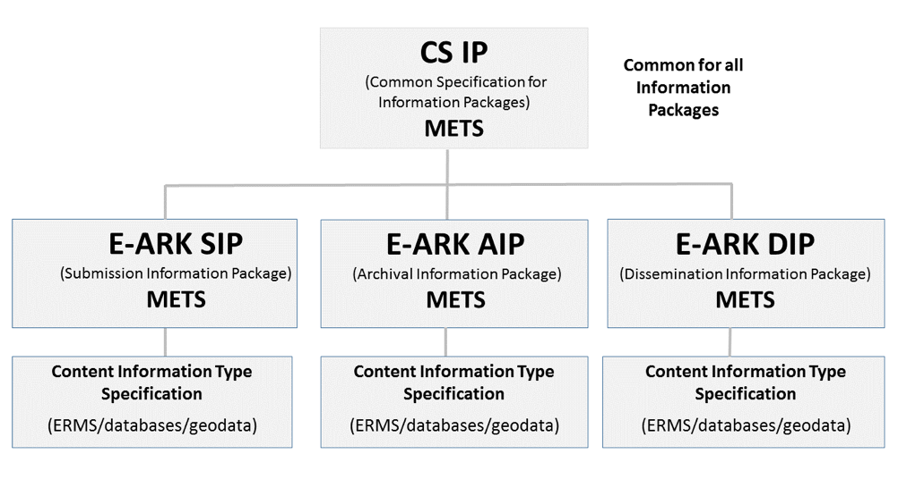
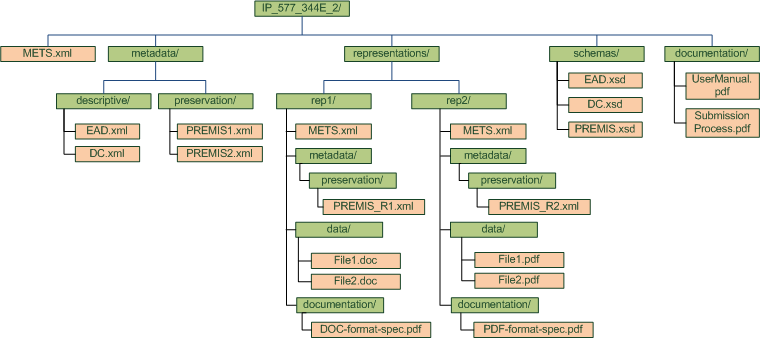

# E-ARK SIP SPECIFICATION v2.0.0-DRAFT

```
Version: 2.0.0-DRAFT
Published: December 20, 2018
```

## Authors

| Name                             | Organisation                                       |
| -------------------------------- | -------------------------------------------------- |
| Miguel Ferreira                  | KEEP SOLUTIONS                                     |
| Hélder Silva                     | KEEP SOLUTIONS                                     |
| Karin Bredenberg                 | National Archives of Sweden                        |
| Carl Wilson                      | Open Preservation Foundation                       |


## Reviewer

| Name                             | Organisation                                       |
| -------------------------------- | -------------------------------------------------- |
| Jaime Kaminski                   | Highbury Associates                                     |


## Front matter (TBD)

* Authors and reviewers (past)
* Revision history and statement of originality
* Executive summary
* Acknowledgments

## Indexes (TBD)

* Table of contents
* List of tables
* List of figures


## Introduction

According to the Open Archival Information System Reference Model (OAIS) every submission of information to an archive occurs as one or more discrete transmissions of Submission Information Packages (SIP). Unfortunately, the OAIS itself does not specify how these information packages should look like. 

The EU funded E-ARK project (2014-2017) first acknowledged this problem and started to develop a solution in the form of a package specification. This specification is now part of a set of specifications currently managed by an independent body named the Digital Information LifeCycle Interoperability Standards Board ([DILCIS Board](http://www.dilcis.eu)).

### Scope and purpose 

This document describes how to produce and parse E-ARK Submission Information Packages (SIP). The main objectives of this specification are to:

* Define the general structure for a Submission Information Package format in a way that it is suitable for a wide variety of archival scenarios, e.g. document and image collections, databases or geographical data;
* Enhance interoperability between Producers and Archives;
* Recommend best practices regarding metadata, content and structure of Submission Information Packages.

### Target audience

The target audience for this specification is records creators, archival institutions and software providers that are responsible with preparing, packaging, delivering and receiving packages of information to be archived in an OAIS, i.e. pre-ingest and ingest functional units.

### Relationship to other E-ARK specifications

This document is part of a set of specifications that define a common understanding of the principles and requirements for interoperable Information Packages according to the OAIS reference model (see Figure 1).

The Common Specification for Information Packages (CS IP) identifies and standardises the common aspects of all information packages (Submission, Archival and Dissemination Information Packages, i.e. SIP, AIP and DIP, respectively) which are equally relevant and implemented by different functional entities of the overall digital preservation process (i.e. pre-ingest, ingest, long-term preservation and access). 

The current E-ARK SIP specification does not repeat the information presented in the CS IP. Only the information that is absolutely necessary to understand the SIP specification is utlised in this document. This means that in order to fully understand this specification it is essential that the user reads the CS IP.



**Figure 1**: Relationships between all E-ARK specifications.

In general, the E-ARK SIP specification reuses and applies all the requirements laid out by the CS IP. However, it extends it with aspects that are solely relevant to the process of transmitting and ingesting submission information into an OAIS environment. For example, the E-ARK SIP specification extends the CS IP with further requirements about submission agreements and information about the actors involved in the submission process.

An additional concept is also part of this set of specifications. That is the Content Information Type Specifications. These are content-dependent specifications that include detailed information on how content, metadata, and documentation for specific types of content (i.e. data) can be handled within the packages. Currently, there are three such specifications:

* E-ARK ERMS: Content Information Type specification for Electronic Records Management Systems; 
* E-ARK Geodata: Content Information Type specification for geospatial information;
* E-ARK SIARD (SIARD1, SIARD2 and SIARDDK): Content Information Type specification for the archiving, preservation and reuse of relational databases.

More information on Content Information Type specifications can be found in the Common Specification for Information Packages or the individual Content Information Type specification documents published by the [DILCIS Board](http://www.dilcis.eu).


### Definition of an SIP

The OAIS reference model defines an SIP as:

> An Information Package that is delivered by the Producer to the OAIS for use in the construction or update of one or more AIPs and/or the associated Descriptive Information. 

The E-ARK SIP follows this definition and builds on the E-ARK Common Specification for Information Packages by extending it to support specific requirements related to the process of selecting, packaging, transmitting, receiving, validating and ingesting information originally maintained by a Producer. 

In summary, the SIP constitutes a package of information that is ready to be sent by a Producer to an Archive in order to be ingested by the OAIS.

### Related work

This document is based on, or influenced by, the following documents and best practices:

* **E-ARK Deliverable D3.1 - Report on Available Best Practices**, 2014, [http://eark-project.com/resources/project-deliverables/6-d31-e-ark-report-on-available-best-practices](http://eark-project.com/resources/project-deliverables/6-d31-e-ark-report-on-available-best-practices)
* **E-ARK Deliverable D2.1 - General pilot model and use case definition**, 2014, [http://eark-project.com/resources/project-deliverables/5-d21-e-ark-general-pilot-model-and-use-case-definition](http://eark-project.com/resources/project-deliverables/5-d21-e-ark-general-pilot-model-and-use-case-definition)
* **FGS package structure**,  2013, [https://riksarkivet.se/Media/pdf-filer/Projekt/FGS_Earkiv_Paket.pdf](https://riksarkivet.se/Media/pdf-filer/Projekt/FGS_Earkiv_Paket.pdf)
* **Reference Model for an Open Archival Information System (OAIS)**, 2012, [http://public.ccsds.org/Pubs/650x0m2.pdf](http://public.ccsds.org/Pubs/650x0m2.pdf)  
* **Producer-Archive Interface Methodology Abstract Standard (PAIMAS)**, 2004, [http://public.ccsds.org/Pubs/651x0m1.pdf](http://public.ccsds.org/Pubs/651x0m1.pdf)
* **Producer-Archive Interface Specification (PAIS) – CCSDS**, 2014, [http://public.ccsds.org/Pubs/651x1b1.pdf](http://public.ccsds.org/Pubs/651x1b1.pdf)
* **e-SENS (Electronic Simple European Networked Services) project**, [http://www.esens.eu/](http://www.esens.eu/)
* **E-ARK Deliverable D3.2 - SIP Draft Specification**, 2015, [http://eark-project.com/resources/project-deliverables/17-d32-e-ark-sip-draft-specification](http://eark-project.com/resources/project-deliverables/17-d32-e-ark-sip-draft-specification)
* **E-ARK Deliverable D3.3 - E-ARK SIP Pilot Specification**, 2016, [http://eark-project.com/resources/project-deliverables/51-d33pilotspec](http://eark-project.com/resources/project-deliverables/51-d33pilotspec)

## Structure

The SIP specification follows a structure that is common to all Information Packages in the E-ARK set of specifications. The common structure is fully described in the Common Specification for Information Packages (see Section 4. CS IP structure).

In its simplest form, an SIP consists of metadata and zero or more representations, also composed of `data` and `metadata`, as seen in Figure 2. A package with zero representations means that it only includes metadata. This is a special type of Information Package that enables Producers to deliver updates to the metadata to previously ingested packages.


**Figure 2**: Simplified view of a package structure.


According to [PREMIS Version 3.0](http://www.loc.gov/standards/premis/v3/premis-3-0-final.pdf):

> A representation is a set of files, including structural metadata, needed for a complete and reasonable rendition of an Intellectual Entity. For example, a journal article may be complete in one PDF file. This single file constitutes the representation. Another journal article may consist of one SGML file and two image files. These three files constitute the representation. A third article may be represented by one TIFF image for each of 12 pages plus an XML file of structural metadata showing the order of the pages. These 13 files constitute the representation.

As one SIP can contain more than one representation of the same intellectual entity, representations MUST be placed within distinct folders (i.e., `rep-001`, `rep-002`, `rep-n` under the ```representations``` folder). In contrast, metadata may exist within each representation folder or at the root level (next to the `representations` folder). Metadata can serve multiple purposes,  the most common one being the support for discoverability of resources within the OAIS (i.e. descriptive metadata).

If metadata is stored at the root level of the package, then there is generally no need to include a `metadata` folder at the representation level. In such cases, the `metadata` folder under representations is considered optional. The SIP also accounts for the following additional folders that can exist both at the root level or under the `representations` folder (Figure 3):

* `documentation` – for including additional documentation about the `data` included in the package (e.g. a data dictionary for a SIARD file);
* `schemas` – for storing schemas of XML files included in the data or metadata.



**Figure 3:** Example of the full use of the SIP structure

The details of the internal structure of an SIP including its `data` and `metadata` folders can be further specified by Submission Agreements. These can exist for a particular submission, a special collection or a specific Producer.


## METS

The Metadata Encoding and Transmission Standard (METS) is a standard for encoding descriptive, administrative, and structural metadata expressed using the XML Schema Language.

The METS Schema for an E-ARK SIP is the same as for an E-ARK AIP or an E-ARK DIP. The actual requirements of the METS used in the E-ARK SIP are defined in the CS IP on section "5.3 Use of METS". However, there are some small differences between a METS instance of an E-ARK SIP and an E-ARK CS IP. Most of the differences consist of setting values of particular attributes, defining controlled vocabularies or making optional elements mandatory.

These differences are manifested by means of a METS profile. The SIP METS profile extends the CS IP METS profile. As stated before, in this document only the differences between the SIP METS and the CS IP METS are highlighted. In order to fully understand how to create or interpret the METS file included within an SIP, it is necessary to read the CS IP.

### Extended use of the METS root element (element `mets`)

The root of a METS document can contain a number of optional attributes, namespaces (`xmlns:`), locations for external schemas (`xsi:`) and a number of other elements.

The following table describes the main differences in the `mets` element between the E-ARK SIP and the CS IP.

| ID | Name & Location | Description & usage | Cardinality & Level |
|----|-----------------|---------------------|-------------------- |
| <a name="SIP1"></a>**SIP1** | **Package name** <br/> `mets/@LABEL` | An optional short text describing the contents of the package, e.g. “Accounting records of 2017". | **0..1** <br/> MAY |
| <a name="SIP2"></a>**SIP2** | **METS Profile** <br/> `mets/@PROFILE` | The value is set to "https://earksip.dilcis.eu/profile/E-ARK-SIP.xml". | **1..1** <br/> MUST |


**Example:** METS root element example with values from E-ARK-SIP as well as CS IP.

```xml
<mets:mets 
	OBJID="uuid-4422c185-5407-4918-83b1-7abfa77de182" 
	LABEL="Accounting records of 2017" 
	TYPE="OTHER" 
	OTHERTYPE="Accounting" 
	PROFILE="https://earksip.dilcis.eu/profile/E-ARK-SIP.xml" 

	schemaLocation="http://www.loc.gov/METS/ http://www.loc.gov/standards/mets/mets.xsd http://www.w3.org/1999/xlink http://www.loc.gov/standards/mets/xlink.xsd https://dilcis.eu/XML/METS/CSIPExtensionMETS https://dilcis.eu/XML/METS/CSIPExtensionMETS/DILCISExtensionMETS.xsd">
</mets:mets>
```


### Extended use of the METS header (element `metsHdr`)

The METS header element `<metsHdr>` includes information about the creator of the submission package, the original creator of the data, contact information of the person delivering the SIP, among other actors. These entities are typically called "agents" (see element `metsHdr/agent`). 

The `metsHdr` is also used to indicate the type of behaviour to be expected from the OAIS when processing a particular SIP. For example, one might indicate that an SIP should be used to "replace" a particular AIP in the repository or that an SIP is meant for "testing" purposes and therefore it should not create an AIP at the end of the ingest process (see attribute `metsHdr/@RECORDSTATUS`).


It is also in the `metsHdr` that the Submission Agreement to which a particular SIP conforms can be identified (see `metsHdr/altrecordID/@TYPE=”SUBMISSIONAGREEMENT`). 

The following table describes the main differences in the `metsHdr` between an E-ARK SIP and the CS IP.

| ID | Name & Location | Description & usage | Cardinality & Level |
|----|-----------------|---------------------|--------------------|
| <a name="SIP3"></a>**SIP3** | **Package status** <br/> `metsHdr/@RECORDSTATUS` | A way of indicating the status of the package and to instruct the OAIS on how to properly handle the package. If not set, the expected behaviour is equal to NEW. <br/> **See also:** <a href="#VocabularyRECORDSTATUS" >Package status</a> | **0..1** <br/> MAY |
| <a name="SIP4"></a>**SIP4** | **OAIS Package type information** <br/> `metsHdr/@csip:OAISPACKAGETYPE` | @csip:OAISPACKAGETYPE is used with the value "SIP". <br/> **See also:** <a href="#VocabularyOAISPackageType" >null</a> | **1..1** <br/> MUST |
| <a name="SIP5"></a>**SIP5** | **Submission agreement** <br/> `metsHDR/altrecordID` | A reference to the Submission Agreement associated with the package. <br/> @TYPE is used with the value "SUBMISSIONAGREEMENT". <br/> Example: RA 13-2011/5329; 2012-04-12 <br/> Example: http://submissionagreement.kb.se/dnr331-1144-2011/20120711/ <br/> Note: It is recommended that a machine-readable format is used for a better description of a submission agreement. <br/> null <br/> **See also:** <a href="#VocabularyaltrecordIDTYPE" >Alternative record ID's</a> | **0..1** <br/> MAY |
| <a name="SIP6"></a>**SIP6** | **Previous Submission agreement** <br/> `metsHDR/altrecordID` | An optional reference to a previous submission agreement(s) which the information may have belonged to. <br/> @TYPE is used with the value "PREVIOUSSUBMISSIONAGREEMENT". <br/> Example: FM 12-2387/12726, 2007-09-19 <br/> Example: http://submissionagreement.kb.se/dnr331-1144-2011/20120711/ <br/> Note: It is recommended to use a machine-readable format for a better description of a submission agreement. <br/> null <br/> **See also:** <a href="#VocabularyaltrecordIDTYPE" >Alternative record ID's</a> | **0..*** <br/> MAY |
| <a name="SIP7"></a>**SIP7** | **Archival reference code** <br/> `metsHDR/altrecordID` | An optional reference code indicating where in the archival hierarchy the package shall be placed in the OAIS. <br/> @TYPE is used with the value "REFERENCECODE". <br/> Example: FM 12-2387/12726, 2007-09-19 <br/> **See also:** <a href="#VocabularyaltrecordIDTYPE" >Alternative record ID's</a> | **0..1** <br/> MAY |
| <a name="SIP8"></a>**SIP8** | **Previous archival reference code** <br/> `metsHDR/altrecordID` | In cases where the SIP originates from other institutions maintaining a reference code structure, this element can be used to record these reference codes and therefore support the provenance of the package when a whole archival description is not submitted with the submission. <br/> @TYPE is used with the value "PREVIOUSREFERENCECODE". <br/> Example: SE/FM/123/123.1/123.1.3 <br/> **See also:** <a href="#VocabularyaltrecordIDTYPE" >Alternative record ID's</a> | **0..*** <br/> MAY |
| <a name="SIP9"></a>**SIP9** | **Archival creator agent** <br/> `metsHdr/agent` | The name of the organisation or person that originally created the data being transferred. <br/> Please note that this might be different from the organisation which has been charged with preparing and sending the SIP to the archives. | **0..1** <br/> MAY |
| <a name="SIP10"></a>**SIP10** | **Archival creator agent role** <br/> `metsHdr/agent/@ROLE` | The role of the archival creator is “ARCHIVIST”. | **1..1** <br/> MUST |
| <a name="SIP11"></a>**SIP11** | **Archival creator agent type** <br/> `metsHdr/agent/@TYPE` | The type of the archival creator agent is “ORGANIZATION” or "INDIVIDUAL". | **1..1** <br/> MUST |
| <a name="SIP12"></a>**SIP12** | **Archival creator agent name** <br/> `metsHdr/agent/name` | The name of the organisation that originally created the data being transferred. <br/> Please note that this might be different from the organisation which has been charged with preparing and sending the SIP to the archives. | **0..1** <br/> MAY |
| <a name="SIP13"></a>**SIP13** | **Archival creator agent additional information** <br/> `metsHdr/agent/note` | The archival creator agent has a note providing a unique identification code for the archival creator. | **0..1** <br/> MAY |
| <a name="SIP14"></a>**SIP14** | **Classification of the archival creator agent additional information** <br/> `metsHdr/agent/note/@csip:NOTETYPE` | The archival creator agent note is typed with the value of "IDENTIFICATIONCODE". <br/> **See also:** <a href="#VocabularyNoteType" >Note type</a> | **1..1** <br/> MUST |
| <a name="SIP15"></a>**SIP15** | **Submitting agent** <br/> `metsHdr/agent` | The name of the organisation or person that submitting the package to the archive | **1..1** <br/> MUST |
| <a name="SIP16"></a>**SIP16** | **Submitting agent role** <br/> `metsHdr/agent/@ROLE` | The role of the archvial creator is “CREATOR”. | **1..1** <br/> MUST |
| <a name="SIP17"></a>**SIP17** | **Submitting agent type** <br/> `metsHdr/agent/@TYPE` | The type of the submitting agent is “ORGANIZATION” or "INDIVIDUAL". | **1..1** <br/> MUST |
| <a name="SIP18"></a>**SIP18** | **Submitting agent name** <br/> `metsHdr/agent/name` | Name of the organisation submitting the package to the archive. | **1..1** <br/> MAY |
| <a name="SIP19"></a>**SIP19** | **Submitting agent additional information** <br/> `metsHdr/agent/note` | The submitting agent has a note providing a unique identification code for the archival creator. | **0..1** <br/> MAY |
| <a name="SIP20"></a>**SIP20** | **Classification of the submitting agent additional information** <br/> `metsHdr/agent/note/@csip:NOTETYPE` | The submitting agent note is typed with the value of "IDENTIFICATIONCODE". <br/> **See also:** <a href="#VocabularyNoteType" >Note type</a> | **1..1** <br/> MUST |
| <a name="SIP21"></a>**SIP21** | **Contact person agent** <br/> `metsHdr/agent` | Contact person for the submission. | **0..*** <br/> MAY |
| <a name="SIP22"></a>**SIP22** | **Contact person agent role** <br/> `metsHdr/agent/@ROLE` | The role of the contact person is “CREATOR”. | **1..1** <br/> MUST |
| <a name="SIP23"></a>**SIP23** | **Contact person agent type** <br/> `metsHdr/agent/@TYPE` | The type of the contact person agent is "INDIVIDUAL". | **1..1** <br/> MUST |
| <a name="SIP24"></a>**SIP24** | **Contact person agent name** <br/> `metsHdr/agent/name` | Name of the contact person. | **1..1** <br/> MUST |
| <a name="SIP25"></a>**SIP25** | **Contact person agent additional information** <br/> `metsHdr/agent/note` | The submitting agent has one or more notes giving the contact information. | **0..*** <br/> MAY |
| <a name="SIP26"></a>**SIP26** | **Preservation agent** <br/> `metsHdr/agent` | The organisation or person that preserves the package. | **0..1** <br/> MAY |
| <a name="SIP27"></a>**SIP27** | **Preservation agent role** <br/> `metsHdr/agent/@ROLE` | The role of the preservation agent is “PRESERVATION”. | **1..1** <br/> MUST |
| <a name="SIP28"></a>**SIP28** | **Preservation agent type** <br/> `metsHdr/agent/@TYPE` | The type of the submitting agent is “ORGANIZATION”. | **1..1** <br/> MUST |
| <a name="SIP29"></a>**SIP29** | **Preservation agent name** <br/> `metsHdr/agent/name` | Name of the organisation preserving the package. | **1..1** <br/> MAY |
| <a name="SIP30"></a>**SIP30** | **Preservation agent additional information** <br/> `metsHdr/agent/note` | The preservation agent has a note providing a unique identification code for the archival creator. | **0..1** <br/> MAY |
| <a name="SIP31"></a>**SIP31** | **Classification of the preservation agent additional information** <br/> `metsHdr/agent/note/@csip:NOTETYPE` | The preservation agent note is typed with the value of "IDENTIFICATIONCODE". <br/> **See also:** <a href="#VocabularyNoteType" >Note type</a> | **1..1** <br/> MUST |


**Example:** METS example of altrecordID's, and SIP agents following the SIP profile as well as CS IP.

```xml
<mets:metsHdr CREATEDATE="2018-04-24T14:37:49.602+01:00" LASTMODDATE="2018-04-24T14:37:49.602+01:00" RECORDSTATUS="NEW" OAISPACKAGETYPE="SIP">
  <mets:agent ROLE="ARCHIVIST" TYPE="ORGANIZATION">
    <mets:name>The Swedish health agency</mets:name>
    <mets:note NOTETYPE="IDENTIFICATIONCODE">VAT:SE201345098701</mets:note>
  </mets:agent>
  <mets:agent ROLE="CREATOR" TYPE="ORGANIZATION">
    <mets:name>The agency, Personnel</mets:name>
    <mets:note NOTETYPE="IDENTIFICATIONCODE">VAT:SE2098109810-AF87</mets:note>
  </mets:agent>
  <mets:agent ROLE="CREATOR" TYPE="INDIVIDUAL">
    <mets:name>Sven Svensson</mets:name>
    <mets:note>Phone: 08-123456, Email: sven.svensson@mail.mail</mets:note>
  </mets:agent>
  <mets:agent ROLE="PRESERVATION" TYPE="ORGANIZATION">
    <mets:name>The archives</mets:name>
    <mets:note NOTETYPE="IDENTIFICATIONCODE">ID:1234567</mets:note>
  </mets:agent>
  <mets:altrecordID TYPE="SUBMISSIONAGREEMENT">http://submissionagreement.kb.se/dnr331-1144-2011/20120711/</mets:altrecordID>
  <mets:altrecordID TYPE="PREVIOUSSUBMISSIONAGREEMENT">FM 12-2387/12726, 2007-09-19</mets:altrecordID>
  <mets:altrecordID TYPE="REFERENCECODE">SE/RA/123456/24/P</mets:altrecordID>
  <mets:altrecordID TYPE="PREVIOUSREFERENCECODE">SE/FM/123/123.1/123.1.3</mets:altrecordID>
</mets:metsHdr>
```


### Extended use of the METS descriptive metadata section (element `dmdSec`)

The METS descriptive metadata section `<dmdSec>` is responsible for recording descriptive metadata for all the data items included in the package. 

The SIP specification itself does not prescribe of any particular metadata format. It is a role of the OAIS together with the Producer to set the rules in terms of descriptive metadata. These rules should be set and agreed on in the Submission Agreement. 

In this regard, the SIP specification does not change or extend any of the requirements already defined by the Common Specification for Information Packages (for more information see section 5.3.3 of the CS IP).

### Extended use of METS administrative metadata section (element `amdSec`)

The METS administrative metadata section `<amdSec>` is used to include or reference technical and preservation metadata. 

Although seldom used, preservation metadata can be included in an SIP. The guide on [Using PREMIS with METS](https://www.loc.gov/standards/premis/premis-mets.html) provides recommendations on how to use the `<amdSec>` element to reference PREMIS metadata. 

The SIP specification does not change or extend any of the requirements already defined by the Common Specification for Information Packages (for more information see section 5.3.4. of the CS IP).


### Extended use of the METS file section (element `fileSec`) 

The METS file section element `<fileSec>` is used to describe all the components included in the information package which have not been already included in the `amdSec` and `dmdSec` elements. 

The main purpose of the METS file section is to serve as a "table of contents" or "manifest" for all the files included in the package, thus allowing the OAIS to validate the integrity and completeness of the files included in the package. This means that for all the files included in the package, their location and checksum need to be available and described in the `fileSec` element. That includes files in the `data` and in the `documentation` folders. 

The following table describes the main differences in the `fileSec` between an E-ARK SIP and the CS IP.

| ID | Name & Location | Description & usage | Cardinality & Level |
|----|-----------------|---------------------| --------------------|
| <a name="SIP32"></a>**SIP32** | **File format name** <br/> `fileSec/fileGrp/file/@sip:FILEFORMATNAME` | Follows the requirements in the CS IP profile. <br/> Follows the requirements in the CS IP profile. <br/> A more detailed file format definition when the use of PREMIS has not been agreed upon in the submission agreement. <br/> Example: "Extensible Markup Language” <br/> Example: ”PDF/A” <br/> Example: ”ISO/IEC 26300:2006” | **0..1** <br/> MAY |
| <a name="SIP33"></a>**SIP33** | **File format version** <br/> `fileSec/fileGrp/file/@sip:FILEFORMATVERSION` | The version of the file format when the use of PREMIS has not been agreed upon in the submission agreement. <br/> Example: "1.0” | **0..1** <br/> MAY |
| <a name="SIP34"></a>**SIP34** | **File format registry** <br/> `fileSec/fileGrp/file/@sip:FILEFORMATREGISTRY` | The name of the format registry used to identify the file format when the use of PREMIS has not been agreed upon in the submission agreement. <br/> Example: "PRONOM” | **0..1** <br/> MAY |
| <a name="SIP35"></a>**SIP35** | **File format registry key** <br/> `fileSec/fileGrp/file/@sip:FILEFORMATKEY` | Key of the file format in the registry when use of PREMIS has not been agreed upon in the submission agreement. <br/> Example: "fmt/101” | **0..1** <br/> MAY |


**Example:** METS example of an SIP with file information together with the info from the CS IP.

```xml
<mets:file 
	ID="uuid-0C0049CA-6DE0-4A6D-8699-7975E4046A81"
	SIZE="2554366" 
	CREATED="2012-08-15T12:08:15.432+01:00" 
	CHECKSUM="91B7A2C0A1614AA8F3DAF11DB4A1C981F14BAA25E6A0336F715B7C513E7A1557" 
	CHECKSUMTYPE="SHA-256" 
	MIMETYPE="application/vnd.openxmlformats-officedocument.wordprocessingml.document"
	FILEFORMATNAME="Microsoft Word for Windows" 
	FILEFORMATVERSION="2007 onwards" 
	FORMATREGISTRY="PRONOM" 
	FORMATREGISTRYKEY="fmt/412">
	
  <mets:FLocat 
		LOCTYPE="URL" 
  		type="simple" 
  		href="documentation/example_file.docx">
  </mets:FLocat>
</mets:file>
```


### Extended use of the METS structural map (element `structMap`)

The mandatory METS structural map element `<structMap>` is intended to provide an overview of the components included in the package. It can also link elements of that structure to associated content files and metadata. In the CS IP the `structMap` describes the higher-level structure of all the content in the root and may link to existing representations.

The SIP specification does not change or extend any of the requirements already defined by the Common Specification for Information Packages (for more information see section 5.3.6 of the CS IP)

## Content Information Type Specifications

The concept of a Content Information Type Specification is essentially an extension method which allows for widening the interoperability scope of the E-ARK IPs into a content specific level. 

A Content Information Type can be understood as a category of Content Information, for example, relational databases, scientific data or digitised maps. A Content Information Type Specification defines in technical terms how data and metadata (mainly in regard to the Information Object) should be formatted and placed within an Information Package in order to achieve interoperability in exchanging specific Content Information.

The SIP presents no extensions or exceptions to the concept of Content Information Type as it is formalised in the Common Specification for Information Packages. More information on this subject can be found in sections 1.2, 1.3 and 6.1 of the CS IP.

##	 Submission Agreement

Interactions between Producers and the OAIS are often guided by a Submission Agreement, which establishes specific details about how these interactions should take place, e.g. the type of information expected to be exchanged, the metadata the Producer is expected to deliver, the logistics of the actual transfer, statements regarding access restrictions on the submitted material, etc.
 
Given the importance of the Submission Agreement, the E-ARK SIP specification provides a way of referring to it regardless of its form. A submission agreement can be delivered in digital (e.g. PDF or XML file) or in analogue forms (i.e. paper document). More information about how to reference the Submission Agreement within the SIP can be found in the section dedicated to the `metsHdr` element. 

According to the [PAIMAS, 2004](http://public.ccsds.org/Pubs/651x0m1.pdf) standard a Submission Agreement should include a complete and precise definition of:
 
- Information to be transferred (e.g. SIP contents, SIP packaging, data models, identification of the designated community, legal and contractual aspects);
- Transfer definition (e.g. specification of the OAIS Data Submission Sessions);
- Validation definition;
- Change management (e.g. conditions for modification of the agreement, for breaking the agreement);
- Schedule (submission timetable).

This specification includes a list of semantic elements that should be present in a standard Submission Agreement (see Appendix A). The E-ARK SIP specification does not require the use of any of these semantic elements or in any way forbids the use of any other Submission Agreement formats. The list of semantic elements provided simply serves as a baseline recommendation.

The recommended list of semantic elements is inspired by the PAIMAS requirements and the [Submission Agreement template](https://www.ngdc.noaa.gov/wiki/images/f/f4/NOAA_Sub_Agreement.docx) provided by the National Oceanic and Atmospheric Administration (NOAA).

## Appendices
 
### Appendix A: Submission Agreement semantic elements

#### Project information

* **Project** -	Elements of a transfer project.
	* 	**Project Name**	 - Name of the transfer project (e.g. Transfer I, 2016).
	* 	**Project ID** - Identification code of the transfer project (e.g. 201601122044).


#### Change management

* **Version/Revision** - Elements for tracking the changes in versions of the submission agreement. 
	* **Release date** - The date of the version.
	* **Change authority** - The information about the person who changed the submission agreement (e.g. John Smith (The National Archives of Estonia)).
	* **Change description**	- A short textual description of the change.
	* **Section(s) affected**	- This element is meant for recording more detailed information about changes.

	
#### Producer, Archive and Designated Community

* **Producer Organization**	- Elements describing the Producer.
	* **Organization name** - **Elements describing the organisation**
	* **Main Contact** - Elements describing the main contact of the transfer project.
		* **Address** -	The address of the main contact.
		* **Telephone**	- The telephone number of the main contact.
		* **E-mail**	 - The e-mail of the main contact.
		* **Additional Information** - Meant for recording any additional information needed to describe the contact.
	* **Individual Contacts**	- Elements describing other individual contacts of the organisation.
		* **Name** - 	The full name of the contact person.
		* **Role**	 - The role of the contact person.
		* **Telephone**	- The telephone number of the contact person.
		* **E-mail** - The e-mail of the contact person.
		* **Additional Information** - Meant for recording any additional information needed to describe the contact.
* **Archive Organization** - Elements describing the Archive.
	* **Organization name** - The official name of the organisation.
	* **Main Contact** - Elements describing the main contact of the transfer project.
		* **Address** - The address of the main contact.
		* **Telephone**	 - The telephone number of the main contact.
		* **E-mail** - The e-mail of the main contact.
		* **Additional Information**	 - Meant for recording any additional information needed to describe the contact.
	* **Individual Contacts**	 - Elements describing other individual contacts of the organisation.
		* **Name** - The full name of the contact person.
		* **Role** - The role of the contact person.
		* **Telephone**	 - The telephone number of the contact person.
		* **E-mail** - 	The e-mail of the contact person.
		* **Additional Information**	 - Element for recording any additional information needed to describe the contact.
* **Designated Community** - Elements describing the Designated Community.
	* **Description** - The textual description of the skills and knowledge base of the designated community. 
	* **Individual Contacts** - Elements describing the individual contacts of the designated community.
		* **Name** - The full name of the contact person.
		* **Role** - The role of the contact person.
		* **Telephone**	 - The telephone number of the contact person.
		* **E-mail**	 - The e-mail of the contact person.
		* **Additional Information**	 - Meant for recording any additional information needed to describe the contact.

#### Submission Information Package (SIP)

* **Content and metadata** - Elements describing the content and metadata of the submission information package.
	* **Description** - A description of data origination, content and coverage.
	* **Platform Information** - A short description of the source system.
	* **Representation Information** - A description of the means to represent the data content (e.g. referencing to data dictionaries, decoding software, etc.).
	* **Preservation Descriptive Information** - A description for keeping data independently understandable (e.g. processing history, platform documentation, algorithm information, technical reports, user manuals, etc.).
	* **Supplemental Information** - Meant for recording any additional information needed to describe the content or metadata of the SIP.
	* **Access Constraints** - 	A description of access restrictions and other legal or contractual access aspects.
* **Data Model**  - 	Elements describing the agreements for the SIP data model.
	* **Content Type** - 	A short description of the content type (e.g. ERMS content).
	* **Reference** - 	A reference to the full agreed data model description.
	* **Additional Information** - 	A description of any other additional information (e.g. description of the physical folder structure of the SIP) related to the data model.

#### Submission Session Information

* **Submission Session** - Elements describing the agreements for the submission session.
	* **Submission Method** - The description of the submission method (e.g. through a digital interface, a physical transfer).
	* **Delivery Schedule** - A description of a delivery schedule (a submission session may have a routine or a complex schedule).
	* **Data Submission Inventory**	 - A description of the complete inventory of data objects (and other items) in the submission session.

#### Ingest

* **Submission Reception** - Elements describing the agreements for the ingest.
	* **Validation**	 - A description of procedures for the quality assurance.
	* **Error Handling** - A description of procedures for the error handling.
	* **Receipt Confirmation** - A description of the receipt confirmation.

#### Submission risks

* **Risks**	- Elements describing the risks and mitigation options of the submission.
	* **Risk Factor** - Meant for listing all risk factors (e.g. the designated community is not properly defined) of the submission.
	* **Mitigation Option** - Meant for listing all mitigation options (e.g. define the designated community together with producers) for the risks.


### Appendix B: E-ARK Information Package METS examples


**Example 1:** Example of a whole METS document describing a submission information package with no representations

```xml
<mets:mets OBJID="uuid-4422c185-5407-4918-83b1-7abfa77de182" LABEL="Accounting records of 2017" TYPE="OTHER" OTHERTYPE="Accounting" PROFILE="https://earksip.dilcis.eu/profile/E-ARK-SIP.xml" schemaLocation="http://www.loc.gov/METS/ http://www.loc.gov/standards/mets/mets.xsd http://www.w3.org/1999/xlink http://www.loc.gov/standards/mets/xlink.xsd https://dilcis.eu/XML/METS/CSIPExtensionMETS https://dilcis.eu/XML/METS/CSIPExtensionMETS/DILCISExtensionMETS.xsd https://dilcis.eu/XML/METS/SIPExtensionMETS https://dilcis.eu/XML/METS/SIPExtensionMETS/SIPExtensionMETS.xsd">
  <mets:metsHdr CREATEDATE="2018-04-24T14:37:49.602+01:00" LASTMODDATE="2018-04-24T14:37:49.602+01:00" RECORDSTATUS="NEW" OAISPACKAGETYPE="SIP">
    <mets:agent ROLE="CREATOR" TYPE="OTHER" OTHERTYPE="SOFTWARE">
      <mets:name>RODA-in</mets:name>
      <mets:note NOTETYPE="SOFTWARE VERSION">2.1.0-beta.7</mets:note>
    </mets:agent>
    <mets:agent ROLE="ARCHIVIST" TYPE="ORGANIZATION">
      <mets:name>The Swedish health agency</mets:name>
      <mets:note NOTETYPE="IDENTIFICATIONCODE">VAT:SE201345098701</mets:note>
    </mets:agent>
    <mets:agent ROLE="CREATOR" TYPE="ORGANIZATION">
      <mets:name>The agency, Personnel</mets:name>
      <mets:note NOTETYPE="IDENTIFICATIONCODE">VAT:SE2098109810-AF87</mets:note>
    </mets:agent>
    <mets:agent ROLE="CREATOR" TYPE="INDIVIDUAL">
      <mets:name>Sven Svensson</mets:name>
      <mets:note>Phone: 08-123456, Email: sven.svensson@mail.mail</mets:note>
    </mets:agent>
    <mets:agent ROLE="PRESERVATION" TYPE="ORGANIZATION">
      <mets:name>The archives</mets:name>
      <mets:note NOTETYPE="IDENTIFICATIONCODE">ID:1234567</mets:note>
    </mets:agent>
    <mets:altrecordID TYPE="SUBMISSIONAGREEMENT">http://submissionagreement.kb.se/dnr331-1144-2011/20120711/</mets:altrecordID>
    <mets:altrecordID TYPE="PREVIOUSSUBMISSIONAGREEMENT">FM 12-2387/12726, 2007-09-19</mets:altrecordID>
    <mets:altrecordID TYPE="REFERENCECODE">SE/RA/123456/24/P</mets:altrecordID>
    <mets:altrecordID TYPE="PREVIOUSREFERENCECODE">SE/FM/123/123.1/123.1.3</mets:altrecordID>
  </mets:metsHdr>
  <mets:dmdSec ID="uuid-906F4F12-BA52-4779-AE2C-178F9206111F" CREATED="2018-04-24T14:37:49.609+01:00">
    <mets:mdRef LOCTYPE="URL" MDTYPE="EAD" MDTYPEVERSION="2002" type="simple" href="metadata/descriptive/ead2002.xml" SIZE="903" CREATED="2018-04-24T14:37:49.609+01:00" CHECKSUM="F24263BF09994749F335E1664DCE0086DB6DCA323FDB6996938BCD28EA9E8153" CHECKSUMTYPE="SHA-256">
    </mets:mdRef>
  </mets:dmdSec>
  <mets:amdSec>
    <mets:digiprovMD ID="uuid-9124DA4D-3736-4F69-8355-EB79A22E943F" CREATED="2018-04-24T14:37:52.783+01:00">
      <mets:mdRef LOCTYPE="URL" type="simple" href="metadata/preservation/premis1.xml" MDTYPE="PREMIS:EVENT" MDTYPEVERSION="3.0" MIMETYPE="text/xml" SIZE="1211" CREATED="2018-04-24T14:37:52.783+01:00" CHECKSUM="8aa278038dbad54bbf142e7d72b493e2598a94946ea1304dc82a79c6b4bac3d5" CHECKSUMTYPE="SHA-256" LABEL="premis1.xml">
      </mets:mdRef>
    </mets:digiprovMD>
    <mets:digiprovMD ID="uuid-48C18DD8-2561-4315-AC39-F941CBB138B3" CREATED="2018-04-24T14:47:52.783+01:00">
      <mets:mdRef LOCTYPE="URL" type="simple" href="metadata/preservation/premis2.xml" MDTYPE="PREMIS:OBJECT" MDTYPEVERSION="3.0" MIMETYPE="text/xml" SIZE="2854" CREATED="2018-04-24T14:37:52.783+01:00" CHECKSUM="d1dfa585dcc9d87268069dc58d5e47956434ec3db4087a75a3885d287f15126f" CHECKSUMTYPE="SHA-256" LABEL="premis2.xml">
      </mets:mdRef>
    </mets:digiprovMD>
  </mets:amdSec>
  <mets:fileSec ID="uuid-CA580D47-8C8B-4E91-ABD5-142EBBE15B84">
    <mets:fileGrp ID="uuid-4ACDC6F3-8A36-4A00-A85F-84A56415E86H" USE="Documentation">
      <mets:file ID="uuid-0C0049CA-6DE0-4A6D-8699-7975E4046A81" MIMETYPE="application/vnd.openxmlformats-officedocument.wordprocessingml.document" SIZE="2554366" CREATED="2012-08-15T12:08:15.432+01:00" CHECKSUM="91B7A2C0A1614AA8F3DAF11DB4A1C981F14BAA25E6A0336F715B7C513E7A1557" CHECKSUMTYPE="SHA-256" FILEFORMATNAME="Microsoft Word for Windows" FILEFORMATVERSION="2007 onwards" FORMATREGISTRY="PRONOM" FORMATREGISTRYKEY="fmt/412">
        <mets:FLocat LOCTYPE="URL" type="simple" href="Documentation/File.docx">
        </mets:FLocat>
      </mets:file>
      <mets:file ID="uuid-0C0049CA-6DE0-4A6D-8699-7975E4046A82" MIMETYPE="application/vnd.openxmlformats-officedocument.wordprocessingml.document" SIZE="2554366" CREATED="2012-08-15T12:08:15.432+01:00" CHECKSUM="91B7A2C0A1614AA8F3DAF11DB4A1C981F14BAA25E6A0336F715B7C513E7A1557" CHECKSUMTYPE="SHA-256" FILEFORMATNAME="Microsoft Word for Windows" FILEFORMATVERSION="2007 onwards" FORMATREGISTRY="PRONOM" FORMATREGISTRYKEY="fmt/412">
        <mets:FLocat LOCTYPE="URL" type="simple" href="Documentation/File2.docx">
        </mets:FLocat>
      </mets:file>
    </mets:fileGrp>
    <mets:fileGrp ID="uuid-4ACDC6F3-8A36-4A00-A85F-84A56415E86F" USE="Schemas">
      <mets:file ID="uuid-A1B7B0DA-E129-48EF-B431-E553F2977FD6" MIMETYPE="application/xml" SIZE="123917" CREATED="2018-04-24T14:37:49.617+01:00" CHECKSUM="0BF9E16ADE296EF277C7B8E5D249D300F1E1EB59F2DCBD89644B676D66F72DCC" CHECKSUMTYPE="SHA-256" FILEFORMATNAME="XML Schema Definition" FORMATREGISTRY="PRONOM" FORMATREGISTRYKEY="x-fmt/280">
        <mets:FLocat LOCTYPE="URL" type="simple" href="schemas/ead2002.xsd">
        </mets:FLocat>
      </mets:file>
    </mets:fileGrp>
    <mets:fileGrp ID="uuid-4ACDC6F3-8A36-4A00-A85F-84A56415E86G" USE="Representations/Submission/Data" CONTENTINFORMATIONTYPE="SIARDDK">
      <mets:file ID="uuid-EE23344D-4F64-40C1-8E18-75839EF661FD" MIMETYPE="application/xml" SIZE="1338744" CREATED="2018-04-24T14:37:49.617+01:00" CHECKSUM="7176A627870CFA3854468EC43C5A56F9BD8B30B50A983B8162BF56298A707667" CHECKSUMTYPE="SHA-256" ADMID="uuid-48C18DD8-2561-4315-AC39-F941CBB138B3 uuid-9124DA4D-3736-4F69-8355-EB79A22E943F" FILEFORMATNAME="Extensible Markup Language" FILEFORMATVERSION="1.0" FORMATREGISTRY="PRONOM" FORMATREGISTRYKEY="fmt/101">
        <mets:FLocat LOCTYPE="URL" type="simple" href="representations/Submission/Data/SIARD.xml">
        </mets:FLocat>
      </mets:file>
    </mets:fileGrp>
  </mets:fileSec>
  <mets:structMap ID="uuid-1465D250-0A24-4714-9555-5C1211722FB8" TYPE="PHYSICAL" LABEL="CSIP StructMap">
    <mets:div ID="uuid-638362BC-65D9-4DA7-9457-5156B3965A18" LABEL="uuid-4422c185-5407-4918-83b1-7abfa77de182">
      <mets:div ID="uuid-A4E1C5B6-CD9B-43EF-8F0C-3FD3AB688F81" LABEL="Metadata" ADMID="uuid-9124DA4D-3736-4F69-8355-EB79A22E943F uuid-48C18DD8-2561-4315-AC39-F941CBB138B3" DMDID="uuid-906F4F12-BA52-4779-AE2C-178F9206111F">
      </mets:div>
      <mets:div ID="uuid-4ACDC6F3-8A36-4A00-A85F-84A56415E86I" LABEL="Documentation" CONTENTIDS="uuid-4ACDC6F3-8A36-4A00-A85F-84A56415E86H">
      </mets:div>
      <mets:div ID="uuid-26757DC2-4C0F-4431-85B5-5943D1AB5CA3" LABEL="Schemas" CONTENTIDS="uuid-4ACDC6F3-8A36-4A00-A85F-84A56415E86F">
      </mets:div>
      <mets:div ID="uuid-35CB3341-D731-4AC3-9622-DB8901CD6736" LABEL="Representations" CONTENTIDS="uuid-4ACDC6F3-8A36-4A00-A85F-84A56415E86G">
      </mets:div>
    </mets:div>
  </mets:structMap>
</mets:mets>
```


### Appendix C: External Schema and Vocabularies

#### E-ARK SIP METS Extension

**Location:**  <a href="https://dilcis.eu/XML/METS/SIPExtensionMETS/SIPExtensionMETS.xsd" >https://dilcis.eu/XML/METS/SIPExtensionMETS/SIPExtensionMETS.xsd</a> <br/> 
**Context:** XML-schema for the attributes added by SIP <br/> 
**Note:**   <br/> 
An extension schema with the added attributes for use in this profile. <br/> 
The schema is used with a namespace prefix of sip <br/> 

#### Controlled Vocabularies

<a name="VocabularyRECORDSTATUS"></a>

#### Package status

**Maintained By:** DILCIS Board <br/> 
**Location:**  <a href="http://earksip.dilcis.eu/schema/" >http://earksip.dilcis.eu/schema/</a> <br/> 
**Context:** Used in @RECORDSTATUS <br/> 
**Description:**   <br/> 
Describes the status of the package. <br/> 


<a name="VocabularyaltrecordIDTYPE"></a>
#### Alternative record ID's

**Maintained By:** DILCIS Board <br/> 
**Location:**  <a href="http://earksip.dilcis.eu/schema/" >http://earksip.dilcis.eu/schema/</a> <br/> 
**Context:** Used in altrecordID/@TYPE <br/> 
**Description:**   <br/> 
Describes the type of the alternative record ID. <br/> 


<a name="VocabularyNoteType"></a>
#### Note type

**Maintained By:** DILCIS Board <br/> 
**Location:**  <a href="http://earksip.dilcis.eu/schema/" >http://earksip.dilcis.eu/schema/</a> <br/> 
**Context:** Used in @csip:NOTETYPE <br/> 
**Description:**   <br/> 
Describes the type of a note for an agent. <br/> 


### Appendix D: A Full List of E-ARK SIP Requirements

| ID | Name & Location | Description & usage | Cardinality & Level |
|----|----|---|---|
| <a name="SIP1"></a>**SIP1** | **Package name** <br/> `mets/@LABEL` | An optional short text describing the contents of the package, e.g. “Accounting records of 2017". | **0..1** <br/> MAY |
| <a name="SIP2"></a>**SIP2** | **METS Profile** <br/> `mets/@PROFILE` | The value is set to "https://earksip.dilcis.eu/profile/E-ARK-SIP.xml". | **1..1** <br/> MUST |
| <a name="SIP3"></a>**SIP3** | **Package status** <br/> `metsHdr/@RECORDSTATUS` | A way of indicating the status of the package and to instruct the OAIS on how to properly handle the package. If not set, the expected behaviour is equal to NEW. <br/> **See also:** <a href="#VocabularyRECORDSTATUS" >Package status</a> | **0..1** <br/> MAY |
| <a name="SIP4"></a>**SIP4** | **OAIS Package type information** <br/> `metsHdr/@csip:OAISPACKAGETYPE` | @csip:OAISPACKAGETYPE is used with the value "SIP". <br/> **See also:** <a href="#VocabularyOAISPackageType" >null</a> | **1..1** <br/> MUST |
| <a name="SIP5"></a>**SIP5** | **Submission agreement** <br/> `metsHDR/altrecordID` | A reference to the Submission Agreement associated with the package. <br/> @TYPE is used with the value "SUBMISSIONAGREEMENT". <br/> Example: RA 13-2011/5329; 2012-04-12 <br/> Example: http://submissionagreement.kb.se/dnr331-1144-2011/20120711/ <br/> Note: It is recommended to use a machine-readable format for a better description of a submission agreement. <br/> null <br/> **See also:** <a href="#VocabularyaltrecordIDTYPE" >Alternative record ID's</a> | **0..1** <br/> MAY |
| <a name="SIP6"></a>**SIP6** | **Previous Submission agreement** <br/> `metsHDR/altrecordID` | An optional reference to a previous submission agreement(s) which the information may have belonged to. <br/> @TYPE is used with the value "PREVIOUSSUBMISSIONAGREEMENT". <br/> Example: FM 12-2387/12726, 2007-09-19 <br/> Example: http://submissionagreement.kb.se/dnr331-1144-2011/20120711/ <br/> Note: It is recommended to use a machine-readable format for a better description of a submission agreement. <br/> null <br/> **See also:** <a href="#VocabularyaltrecordIDTYPE" >Alternative record ID's</a> | **0..*** <br/> MAY |
| <a name="SIP7"></a>**SIP7** | **Archival reference code** <br/> `metsHDR/altrecordID` | An optional reference code indicating where in the archival hierarchy the package shall be placed in the OAIS. <br/> @TYPE is used with the value "REFERENCECODE". <br/> Example: FM 12-2387/12726, 2007-09-19 <br/> **See also:** <a href="#VocabularyaltrecordIDTYPE" >Alternative record ID's</a> | **0..1** <br/> MAY |
| <a name="SIP8"></a>**SIP8** | **Previous archival reference code** <br/> `metsHDR/altrecordID` | In cases where the SIP originates from other institutions maintaining a reference code structure, this element can be used to record these reference codes and therefore support the provenance of the package when a whole archival description is not submitted with the submission. <br/> @TYPE is used with the value "PREVIOUSREFERENCECODE". <br/> Example: SE/FM/123/123.1/123.1.3 <br/> **See also:** <a href="#VocabularyaltrecordIDTYPE" >Alternative record ID's</a> | **0..*** <br/> MAY |
| <a name="SIP9"></a>**SIP9** | **Archival creator agent** <br/> `metsHdr/agent` | The name of the organisation or person that originally created the data being transferred. <br/> Please note that this might be different from the organisation which has been charged with preparing and sending the SIP to the archives. | **0..1** <br/> MAY |
| <a name="SIP10"></a>**SIP10** | **Archival creator agent role** <br/> `metsHdr/agent/@ROLE` | The role of the archival creator is “ARCHIVIST”. | **1..1** <br/> MUST |
| <a name="SIP11"></a>**SIP11** | **Archival creator agent type** <br/> `metsHdr/agent/@TYPE` | The type of the archival creator agent is “ORGANIZATION” or "INDIVIDUAL". | **1..1** <br/> MUST |
| <a name="SIP12"></a>**SIP12** | **Archival creator agent name** <br/> `metsHdr/agent/name` | The name of the organisation that originally created the data being transferred. <br/> Please note that this might be different from the organisation which has been charged with preparing and sending the SIP to the archives. | **0..1** <br/> MAY || <a name="SIP13"></a>**SIP13** | **Archival creator agent additional information** <br/> `metsHdr/agent/note` | The archival creator agent has a note providing a unique identification code for the archival creator. | **0..1** <br/> MAY |
| <a name="SIP14"></a>**SIP14** | **Classification of the archival creator agent additional information** <br/> `metsHdr/agent/note/@csip:NOTETYPE` | The archival creator agent note is typed with the value of "IDENTIFICATIONCODE". <br/> **See also:** <a href="#VocabularyNoteType" >Note type</a> | **1..1** <br/> MUST |
| <a name="SIP15"></a>**SIP15** | **Submitting agent** <br/> `metsHdr/agent` | The name of the organisation or person that submitting the package to the archive | **1..1** <br/> MUST |
| <a name="SIP16"></a>**SIP16** | **Submitting agent role** <br/> `metsHdr/agent/@ROLE` | The role of the archival creator is “CREATOR”. | **1..1** <br/> MUST |
| <a name="SIP17"></a>**SIP17** | **Submitting agent type** <br/> `metsHdr/agent/@TYPE` | The type of the submitting agent is “ORGANIZATION” or "INDIVIDUAL". | **1..1** <br/> MUST |
| <a name="SIP18"></a>**SIP18** | **Submitting agent name** <br/> `metsHdr/agent/name` | Name of the organisation submitting the package to the archive. | **1..1** <br/> MAY |
| <a name="SIP19"></a>**SIP19** | **Submitting agent additional information** <br/> `metsHdr/agent/note` | The submitting agent has a note providing a unique identification code for the archival creator. | **0..1** <br/> MAY |
| <a name="SIP20"></a>**SIP20** | **Classification of the submitting agent additional information** <br/> `metsHdr/agent/note/@csip:NOTETYPE` | The submitting agent note is typed with the value of "IDENTIFICATIONCODE". <br/> **See also:** <a href="#VocabularyNoteType" >Note type</a> | **1..1** <br/> MUST |
| <a name="SIP21"></a>**SIP21** | **Contact person agent** <br/> `metsHdr/agent` | Contact person for the submission. | **0..*** <br/> MAY |
| <a name="SIP22"></a>**SIP22** | **Contact person agent role** <br/> `metsHdr/agent/@ROLE` | The role of the contact person is “CREATOR”. | **1..1** <br/> MUST |
| <a name="SIP23"></a>**SIP23** | **Contact person agent type** <br/> `metsHdr/agent/@TYPE` | The type of the contact person agent is "INDIVIDUAL". | **1..1** <br/> MUST |
| <a name="SIP24"></a>**SIP24** | **Contact person agent name** <br/> `metsHdr/agent/name` | Name of the contact person. | **1..1** <br/> MUST |
| <a name="SIP25"></a>**SIP25** | **Contact person agent additional information** <br/> `metsHdr/agent/note` | The submitting agent has one or more notes giving the contact information. | **0..*** <br/> MAY |
| <a name="SIP26"></a>**SIP26** | **Preservation agent** <br/> `metsHdr/agent` | The organisation or person that preserves the package. | **0..1** <br/> MAY |
| <a name="SIP27"></a>**SIP27** | **Preservation agent role** <br/> `metsHdr/agent/@ROLE` | The role of the preservation agent is “PRESERVATION”. | **1..1** <br/> MUST |
| <a name="SIP28"></a>**SIP28** | **Preservation agent type** <br/> `metsHdr/agent/@TYPE` | The type of the submitting agent is “ORGANIZATION”. | **1..1** <br/> MUST |
| <a name="SIP29"></a>**SIP29** | **Preservation agent name** <br/> `metsHdr/agent/name` | Name of the organisation preserving the package. | **1..1** <br/> MAY |
| <a name="SIP30"></a>**SIP30** | **Preservation agent additional information** <br/> `metsHdr/agent/note` | The preservation agent has a note providing a unique identification code for the archival creator. | **0..1** <br/> MAY |
| <a name="SIP31"></a>**SIP31** | **Classification of the preservation agent additional information** <br/> `metsHdr/agent/note/@csip:NOTETYPE` | The preservation agent note is typed with the value of "IDENTIFICATIONCODE". <br/> **See also:** <a href="#VocabularyNoteType" >Note type</a> | **1..1** <br/> MUST |
| <a name="SIP32"></a>**SIP32** | **File format name** <br/> `fileSec/fileGrp/file/@sip:FILEFORMATNAME` | Follows the requirements in the CSIP profile. <br/> Follows the requirements in the CSIP profile. <br/> A more detailed file format definition when the use of PREMIS has not been agreed upon in the submission agreement. <br/> Example: "Extensible Markup Language” <br/> Example: ”PDF/A” <br/> Example: ”ISO/IEC 26300:2006” | **0..1** <br/> MAY |
| <a name="SIP33"></a>**SIP33** | **File format version** <br/> `fileSec/fileGrp/file/@sip:FILEFORMATVERSION` | The version of the file format when the use of PREMIS has not been agreed upon in the submission agreement. <br/> Example: "1.0” | **0..1** <br/> MAY |
| <a name="SIP34"></a>**SIP34** | **File format registry** <br/> `fileSec/fileGrp/file/@sip:FILEFORMATREGISTRY` | The name of the format registry used to identify the file format when the use of PREMIS has not been agreed upon in the submission agreement. <br/> Example: "PRONOM” | **0..1** <br/> MAY |
| <a name="SIP35"></a>**SIP35** | **File format registry key** <br/> `fileSec/fileGrp/file/@sip:FILEFORMATKEY` | Key of the file format in the registry when use of PREMIS has not been agreed upon in the submission agreement. <br/> Example: "fmt/101” | **0..1** <br/> MAY |


## Glossary

| Archival creator                     | An organisation unit or individual that creates records and/or manages records during their active use.                                                                                                                                                                                                                                                                                                                                                                                                                                                                                                                                                                                                                                                                                                                                                                                                                           |
|--------------------------------------|-----------------------------------------------------------------------------------------------------------------------------------------------------------------------------------------------------------------------------------------------------------------------------------------------------------------------------------------------------------------------------------------------------------------------------------------------------------------------------------------------------------------------------------------------------------------------------------------------------------------------------------------------------------------------------------------------------------------------------------------------------------------------------------------------------------------------------------------------------------------------------------------------------------------------------------|
| Archive                              | An organisation that intends to preserve information for Access and (re)use by a Designated Community.                                                                                                                                                                                                                                                                                                                                                                                                                                                                                                                                                                                                                                                                                                                                                                                                                            |
| Delivering organisation              | The organisation delivering an information package to the archive. For stating and extending the information use of the “Producer organisation name” and “Submitting organisation name” elements is recommended.                                                                                                                                                                                                                                                                                                                                                                                                                                                                                                                                                                                                                                                                                                                  |
| ERMS                                 | A type of content management software known as an Electronic Records Management System.                                                                                                                                                                                                                                                                                                                                                                                                                                                                                                                                                                                                                                                                                                                                                                                                                                           |
| Information Package                  | A logical container composed of optional Content Information and optional associated Preservation Description Information. Associated with this Information Package is Packaging Information used to delimit and identify the Content Information and Package Description information used to facilitate searches for the Content Information.                                                                                                                                                                                                                                                                                                                                                                                                                                                                                                                                                                                    |
| Ingest                               | The OAIS functional entity that contains the services and functions that accept Submission Information Packages from Producers, prepares Archival Information Packages for storage, and ensures that Archival Information Packages and their supporting Descriptive Information become established within the OAIS.                                                                                                                                                                                                                                                                                                                                                                                                                                                                                                                                                                                                               |
| OAIS                                 | The Open Archival Information System is an archive (and a standard: ISO 14721:2003), consisting of an organisation of people and systems that has accepted the responsibility to preserve information and make it available for a Designated Community.                                                                                                                                                                                                                                                                                                                                                                                                                                                                                                                                                                                                                                                                           |
| Producing organisation               | The organisational unit or individual that has the authority to transfer records to an archive. Usually the producer is also the records creator but this is not always the case, sometimes the producer is different from the records creator. For example: An author dies and her literary executor gains the authority to transfer her papers to an archive. The author is the records creator and the literary executor is the producer. For example: Department X gets reorganised out of existence and Department Y, which takes over the functional responsibilities of Department X, gains the authority to transfer the records of Department X to the archive. Department X is the records creator and Department Y is the producer. Counter example: The Department of Widget Science transfers some of its own records to the archive. The Department of Widget Science is the records creator and the producer. |
| Submission Information Package (SIP) | An Information Package that is delivered by the Producer to the OAIS for use in the construction or update of one or more AIPs and/or the associated Descriptive Information.                                                                                                                                                                                                                                                                                                                                                                                                                                                                                                                                                                                                                                                                                                                                                     |
| Submitting organisation              | Name of the organisation submitting the package to the archive. Extends the delivery information since it may be the case that the content of a creator is held by another part of the organisation.                                                                                                                                                                                                                                                                                                                                                                                                                                                                                                                                                                                                                                                                                                                              |


## Bibliography

1.	A Checklist for Documenting PREMIS-METS Decisions in a METS Profile, 2010,
URL: [http://www.loc.gov/standards/premis/premis_mets_checklist.pdf](http://www.loc.gov/standards/premis/premis_mets_checklist.pdf)
2.	E-ARK Report on Available Best Practices, 2014, URL: [http://eark-project.com/resources/project-deliverables/6-d31-e-ark-report-on-available-best-practices](http://eark-project.com/resources/project-deliverables/6-d31-e-ark-report-on-available-best-practices)
3.	e-SENS (Electronic Simple European Networked Services) project, 2015,
URL: [http://www.esens.eu/](http://www.esens.eu/)
4.	Encoded Archival Context for Corporate Bodies, Persons, and Families, 2015, URL: [http://eac.staatsbibliothek-berlin.de](http://eac.staatsbibliothek-berlin.de)
5.	FGS packet structure, 2013, 
URL: [https://riksarkivet.se/Media/pdf-filer/Projekt/FGS_Earkiv_Paket.pdf](https://riksarkivet.se/Media/pdf-filer/Projekt/FGS_Earkiv_Paket.pdf)
6.	Guidelines for using PREMIS with METS for exchange, Revised September 17, 2008,
URL: [http://www.loc.gov/standards/premis/guidelines-premismets.pdf](http://www.loc.gov/standards/premis/guidelines-premismets.pdf)
7.	Media Types, 2015, URL: [https://www.iana.org/assignments/media-types/media-types.xhtml](https://www.iana.org/assignments/media-types/media-types.xhtml)
8.	METS, 2015, URL: [http://www.loc.gov/standards/mets/](http://www.loc.gov/standards/mets/)
9.	METS Profile Components, 2011, URL: [http://www.loc.gov/standards/mets/profile_docs/components.html](http://www.loc.gov/standards/mets/profile_docs/components.html)
10.	METS Profiles, 2012, URL: [http://www.loc.gov/standards/mets/mets-profiles.html](http://www.loc.gov/standards/mets/mets-profiles.html)
11.	Producer, Submission Agreements: Glossary of Terms, 2015, URL: [http://sites.tufts.edu/dca/about-us/research-initiatives/taper-tufts-accessioning-program-for-electronic-records/project-documentation/submission-agreements-glossary-of-terms/](http://sites.tufts.edu/dca/about-us/research-initiatives/taper-tufts-accessioning-program-for-electronic-records/project-documentation/submission-agreements-glossary-of-terms/)
12.	Producer-Archive Interface Methodology Abstract Standard (PAIMAS), 2004,  
URL: [http://public.ccsds.org/Pubs/651x0m1.pdf](http://public.ccsds.org/Pubs/651x0m1.pdf)
13.	Producer-Archive Interface Specification (PAIS) – CCSDS, 2014,
URL: [http://public.ccsds.org/Pubs/651x1b1.pdf](http://public.ccsds.org/Pubs/651x1b1.pdf)
14.	Records Creator, Submission Agreements: [Glossary of Terms, 2015, URL: http://sites.tufts.edu/dca/about-us/research-initiatives/taper-tufts-accessioning-program-for-electronic-records/project-documentation/submission-agreements-glossary-of-terms/](http://sites.tufts.edu/dca/about-us/research-initiatives/taper-tufts-accessioning-program-for-electronic-records/project-documentation/submission-agreements-glossary-of-terms/)
15.	Reference Model for an Open Archival Information System (OAIS), 2012, 
URL: [http://public.ccsds.org/Pubs/650x0m2.pdf](http://public.ccsds.org/Pubs/650x0m2.pdf)
16. Lavoie B, The Open Archival Information System (OAIS) Reference Model: Introductory Guide (2nd Edition), 2014, [http://www.dpconline.org/component/docman/doc_download/1359-dpctw14-02](http://www.dpconline.org/component/docman/doc_download/1359-dpctw14-02)
