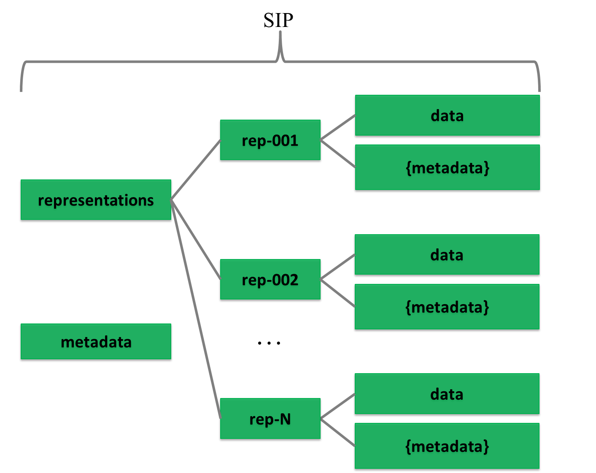
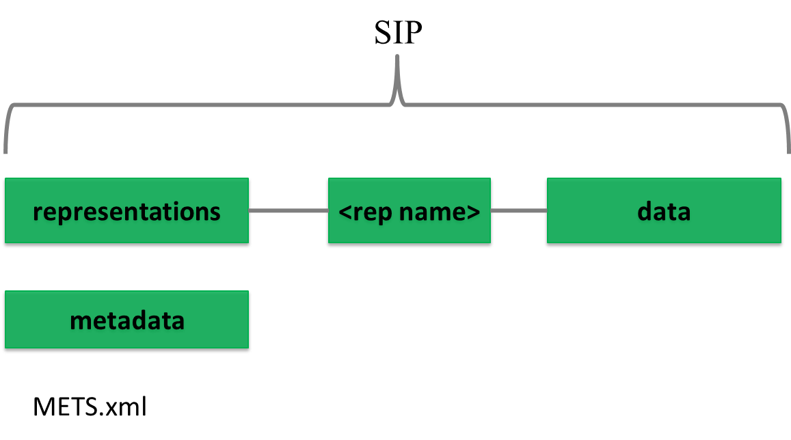

# 2. GENERAL STRUCTURE AND DATA MODEL FOR SUBMISSION INFORMATION PACKAGES 

The SIP specification follows the general structure which is common for all information packages.  The SIP data model describes the package submitted to the archive, which consists of representations (submitted data and metadata) and metadata as seen in Figure 2 (This is a conceptual model and does not describe the actual implementation structure.) and mandated/required by the SIP, AIP and DIP formats.  

As one SIP can contain more than one representation (Digital Object or physical object instantiating or embodying an Intellectual Entity. A Representation that is a Digital Object is the set of stored Files and Structural Metadata needed to provide a complete rendition of the Intellectual Entity. PREMIS Data Dictionary (full document), Version 3.0, 2015, http://www.loc.gov/standards/premis/v3/premis-3-0-final.pdf) of the same intellectual entity then it is reasonable to separate different representations (e.g. Rep-001 and Rep-002 under Representations). This requires additional metadata about the SIP. If we store all metadata (even about representations) at the IP level then we do not need to use the Metadata folder at the representation level. In this case, the Metadata directory under representations is considered optional, as are:

- Documentation folder – for including additional documents that explain the content or its use (e.g. user manual).
- Schemas folder – for adding schemas for the XML files in the data/metadata directly into the package.

If needed, a METS.xml file can be present under representations as well to handle scalability issues. This proposed extended IP structure using divided METS files, is introduced in the Common Specification for Information Packages and in deliverable D4.3 E-ARK AIP pilot specification (E-ARK AIP pilot specification, released January 2016, http://eark-project.com/resources/project-deliverables)  to more easily manage the splitting of large packages using a divided METS structure.

The detailed folder structure of a SIP will also be present and agreed upon in the submission agreement (page 41) by indicating the data model for the submission. Also the details of the internal structure of the data and metadata folders can be further specified in submission agreements.

The metadata model for the SIP will be multi-layered by starting from general common metadata elements and finishing with optional local elements as explained previously (Please note that the business specific (e.g. healthcare records) or local implementation based metadata is not discussed in this specification. As the specifications can be undertaken at different scales, with different types of data and locations, with their constituent technical components, more detailed or localised specifications may be needed.).  
