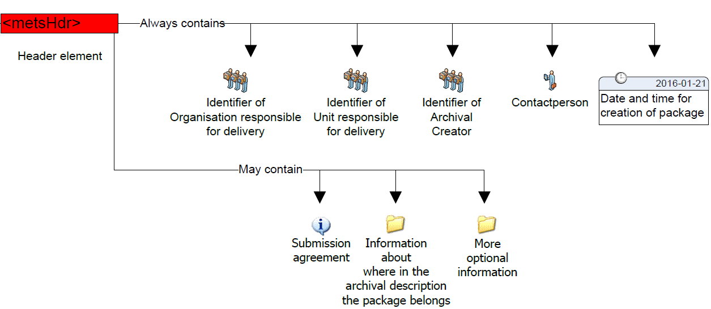
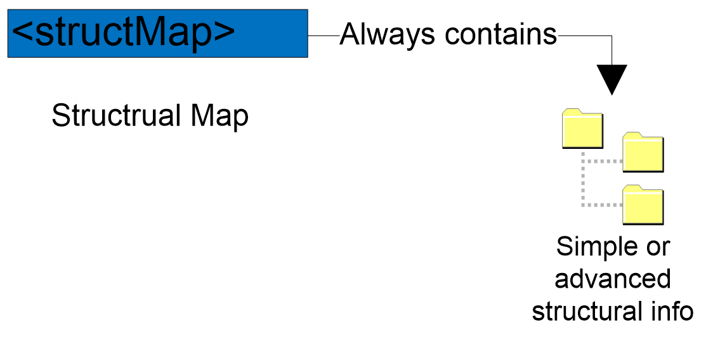

# 3.	GENERAL SIP METADATA 

The general SIP metadata is based on the METS standard and presented as a profile. METS profiles are intended to describe a class of METS documents in sufficient detail to provide both document authors and programmers with the guidance they need to create and process METS documents conforming to a particular [profile](http://www.loc.gov/standards/mets/mets-profiles.html).  

Creating a METS profile requires a good understanding of the METS Profile components. An overview of these components can be found in the [METS online documentation](http://www.loc.gov/standards/mets/profile_docs/components.html) and in Appendix D on page 44 in the [D3.2 specification](http://eark-project.com/resources/project-deliverables/17-d32-e-ark-sip-draft-specification). 

There are 5 main sections in this METS profile:

- ```<metsHdr>``` - METS header (metadata about the creator, contact persons, etc. of the IP).
- ```<dmdSec>``` - descriptive metadata (references to EAD, EAC-CPF, etc.).
- ```<amdSec>``` - administrative metadata (information about how files were created and stored, intellectual property rights, etc.).
- ```<fileSec>``` - file section, lists all files containing content (may also contain metadata about files).
- ```<structMap>``` - structural map, describes the hierarchical structure of the digital object and the whole IP (i.e. object + metadata). 

These sections will be described in more detail in sections 3.1 to 3.6. All these sections present the SIP requirements for METS elements in table form according to the following structure:

- Element - The name of the element in plain text used in the accompanying schema for elements or attributes. For more information regarding elements and attributes in XML see WWW Consortium (http://www.w3.org/).
- Definition - Defines the functions of the element. Contains an explanation of the element and some example values.
- Cardinality – Represents the number of occurrences of an element (see below).
	- 0..1 – The element is optional and cannot be repeated.
	- 0..* – The element is optional and can be repeated.
	- 1 – The element is mandatory and can only be stated once.
	- 1..* – The element is mandatory and has one or more occurrences.
- METS - Defines the element in the METS standard used for designing the SIP element. The column uses XML-syntax. [  ] defines where the value is placed.

## 3.1. Root

The root of a METS document can contain a number of optional attributes, namespaces (xmlns:) and schema instance locations (xsi:) of the external standards referenced in the METS record and a number of other elements as seen in Table 1.

[Table 1 missing]

Example:

```xml
<mets 
  xmlns:xsi="http://www.w3.org/2001/XMLSchema-instance"
  xmlns:xlink="http://www.w3.org/1999/xlink" 
  xmlns="http://www.loc.gov/METS/" 

  PROFILE="http://www.dasboard.eu/specifications/sip/v03/METS.xml" 
  TYPE="ERMS" 
  OBJID="5d378f86-28a1-41d8-a2b9-264b10fbd511"  
  CONTENTTYPESPECIFICATION="SMURFERMS" 
  LABEL="METS file describing the SIP." 
  
  xsi:schemaLocation="http://www.loc.gov/METS/ schemas/METS.xsd http://www.w3.org/1999/xlink schemas/xlink.xsd"
  >
```


## 3.2.	Header

The METS header element <metsHdr> describes metadata about the creator, contact persons, etc. of the submission information package as seen in Figure 4.

 

These are the elements that give information about the submission of the SIP in the METS header element.

[Table 2: Metadata about the information package missing]


Example:

```xml
  <metsHdr CREATEDATE="2016-01-15T10:40:09" RECORDSTATUS="NEW" PACKAGETYPE="SIP">
    <agent TYPE="ARCHIVIST" ROLE="ORGANIZATION">
      <name>The Hungarian Ministry of Healthcare</name>
      <note>ORG:HU121345098701</note>
    </agent>
    <agent TYPE="CREATOR" ROLE="ORGANIZATION">
      <name> The Hungarian Health Agency</name>
      <note>ORG:HU891345098701</note>
    </agent>
    <agent TYPE="PRESERVATION" ROLE="ORGANIZATION">
      <name> National Archives of Hungary</name>
      <note>ORG:HU2010340987</note>
    </agent>
    <agent TYPE="OTHER" ROLE="CREATOR" OTHERTYPE="SOFTWARE">
      <name>SIP Creator</name>
      <note>VERSION=0.0.2</note>
    </agent>
  </metsHdr>
```

## 3.3.	Descriptive metadata 

The METS descriptive metadata element <dmdSec> references to archival description metadata (EAD, EAC-CPF, etc.) as seen in Figure 5.

 

Archival information can be included in the METS package. Usually, for the archival institutions this information is delivered in EAD and EAC-CPF formats.

To include EAD and EAC-CPF in a METS profile the use of <dmdSec> is to be preferred according to the METS implementation guide referenced above. The complete rules for all elements and attributes in the <dmdSec> are stated in the profile, the specific elements used when referencing and embedding is shown below.

Other metadata standards for description and administrative purposes can be used and referencing them must adhere to the <amdSec> and <dmdSec> rules stated in the profile. 

[Table 3: EAD metadata missing]

Example:

```xml
<dmdSec ID="ca14390a-6732-45ba-a466-3c32b7bbacd3">
     <mdRef ID="a9769e81-900a-466c-aee2-86249642532b" 
            LOCTYPE="URL" 
            MDTYPE="EAD" 
            MDTYPEVERSION="3" 
            xlink:type="simple" 
            xlink:href="file://metadata/descriptive/ead.xml" 
            MIMETYPE="text/xml" 
            SIZE="4700" 
            CREATED="2017-01-31T10:22:02.1202592+02:00" 
     		CHECKSUM="ee673e7c9f787a02f4ce30c553e781ac065487c3c9c16ac6381b51e2059f8cf2" 
     		CHECKSUMTYPE="SHA-256" />
</dmdSec>

<dmdSec ID="c9adf006-2383-4e8a-830c-506e47db2188">
     <mdRef ID="b9520eb0-4b1b-4c4f-8c9d-d0677eb2618a" 
            LOCTYPE="URL" 
            MDTYPE="EAC-CPF" 
            MDTYPEVERSION="2010" 
            xlink:type="simple" 
            xlink:href="file://metadata/descriptive/eaccpf.xml" 
            MIMETYPE="text/xml" 
            SIZE="1787" 
            CREATED="2017-01-31T10:22:02.1202592+02:00" 
     		CHECKSUM="1eefac646c8e42d57d7fa9ede829e7b780e89bda7bf6ab5374535664118f3fcf" 
     		CHECKSUMTYPE="SHA-256" />
</dmdSec>
```

## 3.4.	Administrative metadata

The METS administrative metadata element <amdSec> references to technical and preservation metadata as seen in Figure 6.

 

Preservation metadata can be included  in the METS package. It is recommended that PREMIS  is used for preservation metadata.  For further reading:

- More information about PREMIS can be found at: http://www.loc.gov/standards/premis/ . 
- A guide on using PREMIS with METS may be found at: http://www.loc.gov/standards/premis/guidelines-premismets.pdf. 
- Decisions made during the use of PREMIS can be recorded using this document: http://www.loc.gov/standards/premis/premis_mets_checklist.pdf 

The guide on using PREMIS with METS (referenced above) recommends using the `<amdSec>` in order to reference PREMIS metadata. The complete rules for all elements and attributes in the `<amdSec>` are stated in the profile, the specific elements used when referencing are shown below. However, please note that preservation metadata varies for different content types and therefore best practice guidelines should be applied as required. 

[Table 4: PREMIS metadata missing]

Example:

```xml
<amdSec ID="ID1a57e479-20e2-4e99-868b-88d0f816d109">
    <digiprovMD ID="ID41d8bb3c-f7c1-4254-aa9f-825009314fb0">
      <mdRef ID="ID58ecdae0-b6af-4ad9-abf1-f6c2971f253a" 
      		MIMETYPE="text/xml" 
      		xlink:href="file://metadata/preservation/premis1.xml"   
      		LOCTYPE="URL" 
      		CREATED="2015-11-18T15:50:14"
      		CHECKSUM="8aa278038dbad54bbf142e7d72b493e2598a94946ea1304dc82a79c6b4bac3d5" 
      		xlink:type="simple" 
      		MDTYPE="OTHER" CHECKSUMTYPE="SHA-256"/>
    </digiprovMD>
</amdSec>
```


## 3.5.	Files 

The METS file section element <fileSec> lists all files containing content (may also contain metadata about files) as seen in Figure 7.

 

All files found in the submission package should be referenced once and only once in the METS-document describing the submission. The elements and attributes are the same regardless of the content type submitted.

When describing the content and documentation files in METS they are placed in the fileSec element in one or more fileGrp elements. The fileGrp element can be used for grouping files together in different ways. In this profile we do not group files in different groups, we only use one mandatory fileGrp. Use of more fileGrp’s must be decided in every implementation and described in a METS profile.

[Table 5: Files metadata missing]


Example of the <fileSec> element (root METS file):

```xml
<fileSec>
   <fileGrp USE="files root" ID="IDae911aa8-24f0-4bd8-a684-32044b89d687">
      <fileGrp USE="schemas" ID="IDae911aa8-24f0-4bd8-a684-32056b89d789">
         <file 
         		MIMETYPE="application/xsd" 
         		USE="Schema" 
         		CHECKSUMTYPE="SHA-256" 
         		CREATED="2015-12-04T09:59:45" 
         		CHECKSUM="41d38f0a204e7dbda2838d93ad8eb5cf6bed92acd9c2f06f497faf47722e990d" 
         		ID="ID04918b96-cf9f-41fa-ab13-3d550aaf94f5" 
         		SIZE="6814">

            <FLocat 
            		xlink:href="file://schemas/METS.xsd" 
            		xlink:type="simple" 
            		LOCTYPE="URL"/>
         </file>		
      </fileGrp>
      
      <fileGrp USE="representations" ID="IDae055ba8-24f0-4bd8-a684-32056b89d882">
         <fileGrp USE="representation123" ID="IDbc911aa8-24f0-4bd8-a684-32056b89d789">
            <file 
            		MIMETYPE="application/xml" 
            		USE="Representation METS" 
            		CHECKSUMTYPE="SHA-256" 
            		CREATED="2015-12-04T09:59:45" 
            		CHECKSUM="41d38f0a204e7dbda2838d93ad8eb5cf6bed92acd9c2f06f497faf47722e990d" 
            		ID="ID04918b96-cf9f-41fa-ab13-3d550aaf94f5" 
            		SIZE="6814">

               <FLocat 
               		xlink:href="file://representations/representation123/METS.xsd" 
               		xlink:type="simple" 
               		LOCTYPE="URL"/>
            </file>		
         </fileGrp>
      </fileGrp>

      <fileGrp USE="documentation" ID="ID7d136e4c-26fe-40da-85a2-67a42efd6b27">
      ...		
      </fileGrp>
   </fileGrp>
</fileSec>
```

Example of the <fileSec> element (representation METS file):

```xml 
<fileSec>
   <fileGrp USE="Files representation representation123" 
            ID="IDae911aa8-24f0-4bd8-a684-32044b89d687">

      <fileGrp USE="data" ID="IDae911aa8-24f0-4bd8-a684-321556389d687">
         <fileGrp USE="user-defined-data-subfolder" ID="IDae911aa8-24f0-4bd8-a684-32044b89d789">

            <file 
            		MIMETYPE="application/pdf" 
            		USE="data" 
            		CHECKSUMTYPE="SHA-256" 
            		CREATED="2015-12-04T09:59:45" 
            		CHECKSUM="41d38f0a204e7dbda2838d93ad8eb5cf6bed92acd9c2f06f497faf47722e990d" 
            		ID="ID04918b96-cf9f-41fa-ab13-3d550aaf94f5" 
            		SIZE="6814">

               <FLocat 
               		xlink:href="file://data/contentfile.pdf" 
               		xlink:type="simple" 
               		LOCTYPE="URL"/>
            </file>

         </fileGrp>
         ...
      </fileGrp>

      <fileGrp USE="documentation" ID="ID7d136e4c-26fe-40da-85a2-67a42efd6b27">
      ...		
      </fileGrp>

   </fileGrp>
</fileSec>
```

## 3.6.	Structure

The mandatory METS structural map element <structMap> describes the hierarchical structure for the digital object as seen in Figure 8 and follows completely the requirements set in the Common Specification for Information Packages. 
 


Example:

```xml
<structMap ID="cb595ef2-46bf-4c0f-b777-ed21d63c5ac1" TYPE="physical" LABEL=" Common Specification structural map">
   <div ID="ae592e3b-b647-4585-945f-619c5a8b980b" LABEL="9da99df7-2237-48d6-90ef-01d99447c16f">
      <div ID="cbbbb887-e73e-4c35-a3fe-13c85ff47d6f" LABEL="metadata">
         <div ID="fa312f6f-c2b0-4124-89b5-9eec9b8267f9" LABEL="descriptive">
            <fptr FILEID="IDc04f8f55-802e-4646-b5f9-78b8e864e530"/>
            <fptr FILEID="IDa2da0aa8-bf9c-4a79-a83d-2944cb2031ab"/>
         </div>
         <div ID="d90b45ac-f587-42ff-bf20-b69eec1ca2fe" LABEL="preservation">
            <fptr FILEID="IDc2ccef19-802e-4646-b5f9-78b8e864e532"/>
            <fptr FILEID="IDa2da11a8-bf9c-4a79-a83d-2944cbfee654"/>
         </div>
      </div>
      <div ID="ebcb69c0-a719-483a-8991-a7af65fa290c" LABEL="schemas">
         <fptr FILEID="ID845a7a5b-0cfe-43ff-acd9-14f5f0463e28"/>
      </div>
      <div ID="d958361d-a147-41dc-b657-b11a20205cab" LABEL="representations"/>
         <div ID="be0ac8a7-0be9-4222-b307-5306d75b88c1" LABEL="representations/rep1">
            <mptr xlink:href="file://representations/rep1/METS.xml" xlink:type="simple" LOCTYPE="URL"/>
         </div>
         <div ID="d7fc076e-0287-4105-acf4-1a44d0172c7a" LABEL="representations/rep2">
            <mptr xlink:href="file://representations/rep2/METS.xml" xlink:type="simple" LOCTYPE="URL"/>
         </div>
   </div>
</structMap>
```


