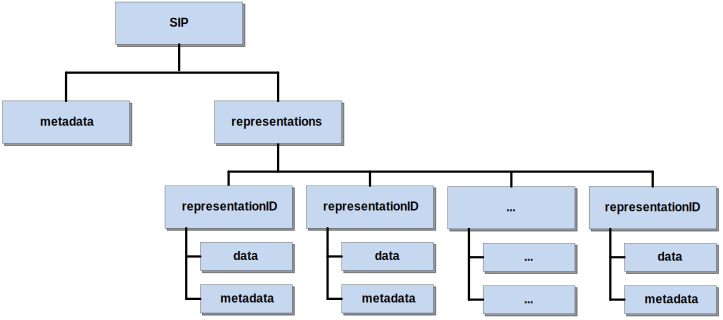

# Introduction

According to ISO 14721:2012 - Open archival information system (OAIS) Reference model, every submission to an archive is made through one or more distinct transmissions of Submission Information Packages (SIP). However, the OAIS Reference Model itself does not provide detailed guidelines on the structure of these information packages.

Addressing this gap, the European Union-funded E-ARK project, which ran from 2014 to 2017, recognized the issue and initiated the development of a standardized package specification. This effort aimed to define a clear and actionable framework for the creation and management of Submission Information Packages, thereby enhancing the interoperability and effectiveness of digital archiving processes.

Today, this specification is among a series of standards overseen by the Digital Information LifeCycle Interoperability Standards Board ([DILCIS Board](http://www.dilcis.eu)), an independent entity dedicated to the maintenance and promotion of digital information lifecycle standards.

## Scope and purpose

This document describes how to produce and parse E-ARK Submission Information Packages (SIP). The main objectives of this specification are to:

- Define the general structure for a Submission Information Package format in a way that it is suitable for a wide variety of archival scenarios, e.g. document and image collections, databases, geographical data, etc.;
- Enhance interoperability between Producers and Archives;
- Recommend best practices regarding metadata, content and structure of Submission Information Packages.

## Target audience

This specification is designed for a broad audience, including record creators, archival institutions, and software providers tasked with the preparation, packaging, delivery, and reception of information packages for archiving within an Open Archival Information System (OAIS), specifically targeting the pre-ingest and ingest stages.

## Definition of SIP

The OAIS reference model defines a Submission Information Package (SIP) as follows:

> An Information Package that is delivered by the Producer to the OAIS for use in the construction or update of one or more AIPs and/or the associated Descriptive Information.

The E-ARK SIP is aligned with this definition, expanding upon the E-ARK Common Specification for Information Packages (CSIP). It enhances this specification by incorporating specific requirements essential for selecting, packaging, transmitting, receiving, validating, and ingesting information originally held by a Producer.

# Structure

The SIP specification follows a structure that is common to Information Packages in the E-ARK set of specifications. The common structure is fully described in the Common Specification for Information Packages (see Section 4. CSIP structure).

In its simplest form, an SIP consists of metadata and zero or more representations, also composed of `data` and `metadata`, as seen in [Figure 2](#fig2). A package with zero representations means that it only contains metadata. This is a special type of Information Package that enables Producers to deliver updates to the metadata to previously ingested packages.

**Figure 2**: Simplified view of the structure of an information package.

According to [PREMIS Version 3.0](http://www.loc.gov/standards/premis/v3/premis-3-0-final.pdf):

> A representation is a set of files, including structural metadata, needed for a complete and reasonable rendition of an Intellectual Entity. For example, a journal article may be complete in one PDF file. This single file constitutes the representation. Another journal article may consist of one SGML file and two image files. These three files constitute the representation. A third article may be represented by one TIFF image for each of 12 pages plus an XML file of structural metadata showing the order of the pages. These 13 files constitute the representation.

As one SIP may contain multiple representations of the same intellectual entity, representations MUST be placed within distinct folders (i.e., `rep-001`, `rep-002`, `rep-n` under the `representations` folder). In contrast, metadata may exist within each representation folder or at the root level (next to the `representations` folder). Metadata can serve multiple purposes, being the most common one the support for discoverability of resources within the OAIS (i.e. descriptive metadata).

If metadata is stored at the root level of the package, then there is generally no need to include `metadata` at the representation level. In such cases, the `metadata` folder under representations is considered optional. The SIP also accounts for the following additional folders, which can exist both at the root level or under the `representations` folder ([Figure 3](#fig3)):

- `documentation` – includes materials that provide additional context or clarification about the data it contains. For instance, this might encompass a data dictionary for a SIARD (Software-Independent Archiving of Relational Databases) file. Such documentation is crucial for ensuring that the data can be accurately interpreted, used, and preserved over time. It serves as a valuable resource for understanding the structure, meaning, and organization of the data, making it an essential component of the package for both current users and future stakeholder;
- `schemas` – designated for holding the schemas of XML files that are part of the data or metadata. It serves as a central repository for XML schemas, enabling consistent validation and interpretation of the XML structures within the package. This ensures that both the data and metadata are structured in a manner that adheres to predefined standards and formats, facilitating accurate data exchange and interoperability between systems.

**Figure 3:** Example of the full use of the SIP structure

The details of the internal structure of an SIP including its `data` and `metadata` folders can be further specified by `Submission Agreements`. These can exist for a particular submission, a special collection or a specific Producer.

# METS

The Metadata Encoding and Transmission Standard (METS) is a standard for encoding descriptive, administrative, and structural metadata expressed using the XML Schema Language.

METS schema is utilized across the various types of packages (SIP, AIP and DIP) maintaining a consistent approach to metadata encoding anda data structuring. The specific application of the METS schema within an E-ARK packages is detailed in the Common Specification for Information Packages (CSIP), particularly in section "5.3 Use of METS". This section outlines how METS should be implemented, including the precise requirements for its use within the E-ARK information packages.

Although the METS schema serves as a common foundation for SIPs, AIPs, and DIPs within E-ARK information packages, there are subtle differences in its application across these packages. These variations are mainly in the customization of attribute values, the definition of controlled vocabularies, and the adjustment of element optionality - transforming some optional elements into mandatory ones. Such adjustments ensure that the METS schema is optimally tailored to meet the specific needs of each package type, enhancing the precision and utility of metadata encoding for digital preservation and access.

The specific differences between the METS instances for SIP and the Common Specification for Information Packages (CSIP) are articulated through what is known as a METS profile. A METS profile is a detailed document that defines how the METS schema is adapted or extended for particular use cases or types of digital packages. In this context, the SIP METS profile is an extension of the more general CSIP METS profile, focusing on the particular requirements and adaptations necessary for Submission Information Packages within the E-ARK Information Packages framework.

## Extended use of the METS root element (element `mets`)

The root element of a METS document `<mets>` can contain a number of optional attributes, namespaces (`xmlns:`), locations for external schemas (`xsi:`) and a number of other elements.

The following table describes the differences in the `<mets>` element between the E-ARK SIP and the `<mets>` element of a Common Specification for Information Packages (CSIP).

!INCLUDE "implementation/metadata/mets/mets-root/requirements.md"

!INCLUDE "implementation/metadata/mets/mets-root/examples.md"

## Extended use of the METS header (element `metsHdr`)

The `<metsHdr>` (METS header) element is a crucial part of the METS schema, providing metadata about the creation and management of the Submission Information Package (SIP). This element encapsulates information about various actors involved in the creation, preparation, and submission of the SIP. These actors are referred to as "agents" and are represented within the METS schema by the `<agent>` element, which is nested within the `<metsHdr>` element.

Each `<agent>` element can describe a range of roles and responsibilities associated with the SIP, including but not limited to:

- **CREATOR**: This refers to the organization or individual responsible for assembling the SIP and preparing it for submission. This agent is typically responsible for ensuring that the SIP conforms to the required standards and specifications.
- **ARCHIVIST**: This agent refers to the individual or organization responsible for the document/collection.. In many cases, this may be different from the creator of the SIP, especially if the SIP contains archived materials or data collected from various sources.
- **SUBMITTER**: This details the contact information for the individual or entity responsible for the actual submission of the SIP to the archive or repository. This information is crucial for communication purposes, especially if there are queries or issues related to the SIP.
- **PRESERVATION**: This details the contact information for the individual or entity responsible for preservation functions.
- **OTHER**: There can be additional agents involved in the lifecycle of the SIP, such as editors, publishers, or custodians, each playing a specific role in the creation, maintenance, or submission of the digital content.

The `metsHdr/agent` elements allow for the detailed documentation of each agent's role, name, note, and other identifiers, thereby providing a comprehensive record of all parties involved in the SIP's creation and management. This structured approach not only facilitates accountability and transparency but also enhances the metadata's richness and usefulness for future archival processing and access.

The `<metsHdr>` is also used to indicate the type of behaviour to be expected from the OAIS when processing a particular SIP. For example, one might indicate that an SIP should be used to "replace" a particular AIP in the repository or that an SIP is meant for "testing" purposes and therefore it should not create an AIP at the end of the ingest process (see attribute `metsHdr/@RECORDSTATUS`).

It is also in the `metsHdr` that the `Submission Agreement` to which a particular SIP conforms can be identified (see `metsHdr/altrecordID/@TYPE=”SUBMISSIONAGREEMENT`).

The following table describes the differences in the `metsHdr` between an E-ARK SIP and the CSIP.

!INCLUDE "implementation/metadata/mets/metshdr/requirements.md"

!INCLUDE "implementation/metadata/mets/metshdr/examples.md"

## Extended use of the METS descriptive metadata section (element `dmdSec`)

The METS descriptive metadata section `<dmdSec>` is responsible for recording descriptive metadata for all the data items included in the package.

The SIP specification itself does not prescribe of any particular metadata format. It is a role of the OAIS together with the Producer to set the rules in terms of descriptive metadata. These rules should be set and agreed upon in the `Submission Agreement`.

In the context of the `<dmdSec>` element, the SIP specification does not change or extend any of the requirements already defined by the Common Specification for Information Packages (for more information see section 5.3.3 of the CSIP).

## Extended use of METS administrative metadata section (element `amdSec`)

The `<amdSec>` (administrative metadata section) in a METS document plays a crucial role in encapsulating or referencing the technical and preservation metadata related to a digital object or collection. This section is pivotal for maintaining the integrity, understanding, and long-term preservation of digital resources.

Preservation metadata, while not always found within Submission Information Packages, holds significant value, especially in recording the history of events affecting the state and stewardship of the information package. Preservation metadata is primarily associated with activities undertaken after a package's ingestion into a digital repository. However, certain preservation events, such as the digitization of analog materials, may occur prior to ingest and are thus relevant for inclusion within an SIP. Documenting such pre-ingest preservation activities provides a comprehensive record of the efforts taken to convert, preserve, and prepare digital objects for archiving and future access.

The [Using PREMIS with METS guide](https://www.loc.gov/standards/premis/premis-mets.html) by the Library of Congress offers detailed recommendations on how to effectively incorporate PREMIS metadata within a METS document, ensuring that vital preservation details are accurately represented and accessible.

In the context of `<amdSec>`, the SIP specification does not change or extend any of the requirements already defined by the Common Specification for Information Packages (for more information see section 5.3.4 of the CSIP).

## Extended use of the METS file section (element `fileSec`)

The METS file section element `<fileSec>` is used to describe all the components included in the information package which have not been already included in the `<amdSec>` and `<dmdSec>` elements.

The main purpose of the METS `<filSec>` element is to serve as a "table of contents" or "manifest" for all the files included in the package, thus allowing the OAIS to validate the integrity and completeness of the files that are part of the package.

This means that the location and checksum of all the files that compose the SIP must be enlisted within the `<fileSec>` element. This includes files in the `data`, `schemas` and in the `documentation` folders.

The following table describes the differences in the `<fileSec>` between an E-ARK SIP and the CSIP.

!INCLUDE "implementation/metadata/mets/filesec/requirements.md"

!INCLUDE "implementation/metadata/mets/filesec/examples.md"

## Extended use of the METS structural map (element `structMap`)

The mandatory METS structural map element `<structMap>` is intended to provide an overview of the components included in the package. It can also link elements of that structure to associated content files and metadata. In the CSIP the `structMap` describes the higher-level structure of all the content in the root and may link to existing representations.

In the context of `<structMap>`, the SIP specification does not change or extend any of the requirements defined by the Common Specification for Information Packages (for more information see section 5.3.6 of the CSIP)

# Content Information Type Specifications (CITS)

The concept of Content Information Type Specifications (CITS) constitutes an extension method designed to improve the interoperability and adaptability of the E-ARK Information Packages (IPs) at a content-specific level. By introducing CITS, E-ARK provides detailed guidelines for handling various types of digital content within archival processes, ensuring that these diverse content types are managed, exchanged and preserved in a manner that is both standardized and tailored to their unique characteristics.

A Content Information Type can be understood as a category of Content Information, for example, relational databases, scientific data or digitised maps. A CITS defines in technical terms how data and metadata (mainly in regard to the Information Object) should be formatted and placed within an Information Package in order to achieve interoperability between different stakeholders.

The SIP specification does not introduce extensions or exceptions to the concept of Content Information Type as it is formalised in the Common Specification for Information Packages. More information on this subject can be found in sections 1.2, 1.3 and 6.1 of the CSIP.

## Submission Agreements

Interactions between Producers and the OAIS are often guided by a `Submission Agreement`, which establishes specific details about how these interactions should take place, e.g. the type of information expected to be exchanged, the metadata the Producer is expected to deliver, the logistics of the actual transfer, statements regarding access restrictions on the submitted material, etc.

Given the importance of `Submission Agreements`, the E-ARK SIP specification provides a way of referring such documents regardless of their form. A Submission Agreement can be delivered as a digital file (e.g. PDF or XML) or in analogue forms (i.e. paper document). More information about how to reference the Submission Agreement within the SIP can be found in the section dedicated to the `metsHdr` element.

According to [PAIMAS](https://public.ccsds.org/Pubs/651x0m1.pdf) ( Producer-Archive Interface Methodology Abstract Standard) a Submission Agreement should include a complete and precise definition of:

- Information to be transferred (e.g. SIP contents, SIP packaging, data models, identification of the designated community, legal and contractual aspects);
- Transfer definition (e.g. specification of the OAIS Data Submission Sessions);
- Validation definition;
- Change management (e.g. conditions for modification of the agreement, for breaking the agreement);
- Schedule (submission timetable).

This specification includes a list of semantic elements that should be present in a standard `Submission Agreement` (see Appendix A). The list of semantic elements is inspired by PAIMAS and the Submission Agreement provided by the National Oceanic and Atmospheric Administration (NOAA).

The E-ARK SIP specification does not require the use of any of these semantic elements or in any way forbids the use of other Submission Agreement formats. This list is merely a recommendation.

# Appendices

This section includes supplementary information that may help the reader to better understand this specification.

## Appendix A: Submission Agreement semantic elements

The following list of semantic elements provide a starting point for anyone willing to prepare a Submission Agreement. This list is not prescriptive, or by any means complete. It merely serves the purpose of outlining the most relevant semantic elements that should be present in a Submission Agreement.

### Project information

- **Project** - Elements of a transfer project.
  - **Project Name** - Name of the transfer project (e.g. Transfer I, 2016).
  - **Project ID** - Identification code of the transfer project (e.g. 201601122044).

### Change management

- **Version/Revision** - Elements for tracking the changes in versions of the submission agreement.
  - **Release date** - The date of the version.
  - **Change authority** - The information about the person who changed the submission agreement (e.g. John Smith (The National Archives of Estonia)).
  - **Change description** - A short textual description of the change.
  - **Section(s) affected** - This element is meant for recording more detailed information about changes.

### Producer, Archive and Designated Community

- **Producer Organization** - Elements describing the Producer.
  - **Organization name** - **Elements describing the organisation**
  - **Main Contact** - Elements describing the main contact of the transfer project.
    - **Address** - The address of the main contact.
    - **Telephone** - The telephone number of the main contact.
    - **E-mail** - The e-mail of the main contact.
    - **Additional Information** - Meant for recording any additional information needed to describe the contact.
  - **Individual Contacts** - Elements describing other individual contacts of the organisation.
    - **Name** - The full name of the contact person.
    - **Role** - The role of the contact person.
    - **Telephone** - The telephone number of the contact person.
    - **E-mail** - The e-mail of the contact person.
    - **Additional Information** - Meant for recording any additional information needed to describe the contact.
- **Archive Organization** - Elements describing the Archive.
  - **Organization name** - The official name of the organisation.
  - **Main Contact** - Elements describing the main contact of the transfer project.
    - **Address** - The address of the main contact.
    - **Telephone** - The telephone number of the main contact.
    - **E-mail** - The e-mail of the main contact.
    - **Additional Information** - Meant for recording any additional information needed to describe the contact.
  - **Individual Contacts** - Elements describing other individual contacts of the organisation.
    - **Name** - The full name of the contact person.
    - **Role** - The role of the contact person.
    - **Telephone** - The telephone number of the contact person.
    - **E-mail** - The e-mail of the contact person.
    - **Additional Information** - Element for recording any additional information needed to describe the contact.
- **Designated Community** - Elements describing the Designated Community.
  - **Description** - The textual description of the skills and knowledge base of the designated community.
  - **Individual Contacts** - Elements describing the individual contacts of the designated community.
    - **Name** - The full name of the contact person.
    - **Role** - The role of the contact person.
    - **Telephone** - The telephone number of the contact person.
    - **E-mail** - The e-mail of the contact person.
    - **Additional Information** - Meant for recording any additional information needed to describe the contact.

### Submission Information Package (SIP)

- **Content and metadata** - Elements describing the content and metadata of the submission information package.
  - **Description** - A description of data origination, content and coverage.
  - **Platform Information** - A short description of the source system.
  - **Representation Information** - A description of the means to represent the data content (e.g. referencing to data dictionaries, decoding software, etc.).
  - **Preservation Descriptive Information** - A description for keeping data independently understandable (e.g. processing history, platform documentation, algorithm information, technical reports, user manuals, etc.).
  - **Supplemental Information** - Meant for recording any additional information needed to describe the content or metadata of the SIP.
  - **Access Constraints** - A description of access restrictions and other legal or contractual access aspects.
- **Data Model** - Elements describing the agreements for the SIP data model.
  - **Content Type** - A short description of the content type (e.g. ERMS content).
  - **Reference** - A reference to the full agreed data model description.
  - **Additional Information** - A description of any other additional information (e.g. description of the physical folder structure of the SIP) related to the data model.

### Submission Session Information

- **Submission Session** - Elements describing the agreements for the submission session.
  - **Submission Method** - The description of the submission method (e.g. through a digital interface, a physical transfer).
  - **Delivery Schedule** - A description of a delivery schedule (a submission session may have a routine or a complex schedule).
  - **Data Submission Inventory** - A description of the complete inventory of data objects (and other items) in the submission session.

### Ingest

- **Submission Reception** - Elements describing the agreements for the ingest.
  - **Validation** - A description of procedures for the quality assurance.
  - **Error Handling** - A description of procedures for the error handling.
  - **Receipt Confirmation** - A description of the receipt confirmation.

### Submission risks

- **Risks** - Elements describing the risks and mitigation options of the submission.
  - **Risk Factor** - Meant for listing all risk factors (e.g. the designated community is not properly defined) of the submission.
  - **Mitigation Option** - Meant for listing all mitigation options (e.g. define the designated community together with producers) for the risks.

## Appendix B: E-ARK Information Package METS example

!INCLUDE "appendices/examples/examples.md"

## Appendix C: External Schema

!INCLUDE "appendices/schema/schema.md"

## Appendix D: External Vocabularies

!INCLUDE "appendices/vocabs/vocabs.md"

## Appendix E: A Full List of E-ARK SIP Requirements

!INCLUDE "appendices/requirements/requirements.md"

# Glossary

| Term                                 | Definition                                                                                                                                                                                                                                                                                                                                                                                                                                                                                                                                                                                                                                                                                                                                                                                                                                                                                                                   |
| ------------------------------------ | ---------------------------------------------------------------------------------------------------------------------------------------------------------------------------------------------------------------------------------------------------------------------------------------------------------------------------------------------------------------------------------------------------------------------------------------------------------------------------------------------------------------------------------------------------------------------------------------------------------------------------------------------------------------------------------------------------------------------------------------------------------------------------------------------------------------------------------------------------------------------------------------------------------------------------- |
| Archival creator                     | Organisation unit or individual that creates records and/or manages records during their active use.                                                                                                                                                                                                                                                                                                                                                                                                                                                                                                                                                                                                                                                                                                                                                                                                                         |
| Archive                              | An organisation that intends to preserve information for Access and (re)use by a Designated Community.                                                                                                                                                                                                                                                                                                                                                                                                                                                                                                                                                                                                                                                                                                                                                                                                                       |
| Delivering organisation              | The organisation delivering an information package to the archive. For stating and extending the information use of the “Producer organisation name” and “Submitting organisation name” elements is recommended.                                                                                                                                                                                                                                                                                                                                                                                                                                                                                                                                                                                                                                                                                                             |
| ERMS                                 | A type of content management software known as an Electronic Records Management System.                                                                                                                                                                                                                                                                                                                                                                                                                                                                                                                                                                                                                                                                                                                                                                                                                                      |
| Information Package                  | A logical container composed of optional Content Information and optional associated Preservation Description Information. Associated with this Information Package is Packaging Information used to delimit and identify the Content Information and Package Description information used to facilitate searches for the Content Information.                                                                                                                                                                                                                                                                                                                                                                                                                                                                                                                                                                               |
| Ingest                               | The OAIS functional entity that contains the services and functions that accept Submission Information Packages from Producers, prepares Archival Information Packages for storage, and ensures that Archival Information Packages and their supporting Descriptive Information become established within the OAIS.                                                                                                                                                                                                                                                                                                                                                                                                                                                                                                                                                                                                          |
| OAIS                                 | The Open Archival Information System is an archive (and a standard: ISO 14721:2003), consisting of an organisation of people and systems that has accepted the responsibility to preserve information and make it available for a Designated Community.                                                                                                                                                                                                                                                                                                                                                                                                                                                                                                                                                                                                                                                                      |
| Producing organisation               | The organisational unit or individual that has the authority to transfer records to an archive. Usually the producer is also the records creator but this is not always the case, sometimes the producer is different from the records creator. For example: An author dies and her literary executor gains the authority to transfer her papers to an archive. The author is the records creator and the literary executor is the producer. For example: Department X gets reorganised out of existence and Department Y, which takes over the functional responsibilities of Department X, gains the authority to transfer the records of Department X to the archive. Department X is the records creator and Department Y is the producer. Counter example: The Department of Widget Science transfers some of its own records to the archive. The Department of Widget Science is the records creator and the producer. |
| Submission Information Package (SIP) | An Information Package that is delivered by the Producer to the OAIS for use in the construction or update of one or more AIPs and/or the associated Descriptive Information.                                                                                                                                                                                                                                                                                                                                                                                                                                                                                                                                                                                                                                                                                                                                                |
| Submitting organisation              | Name of the organisation submitting the package to the archive. Extends the delivery information since it may be the case that the content of a creator is held by another part of the organisation.                                                                                                                                                                                                                                                                                                                                                                                                                                                                                                                                                                                                                                                                                                                         |
