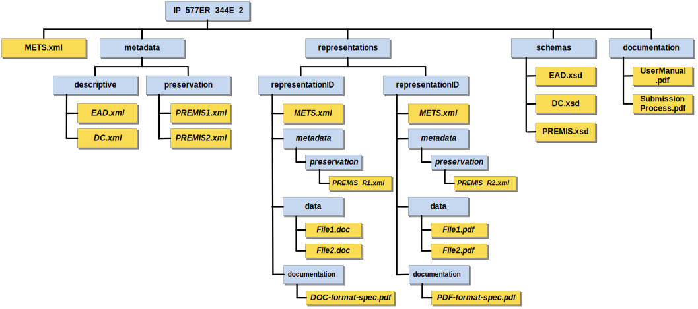

# Introduction

According to ISO 14721:2012 - Open archival information system (OAIS) Reference model, every submission to an archive is made through one or more distinct transmissions of Submission Information Packages (SIP). However, the OAIS Reference Model itself does not provide detailed guidelines on the structure of these information packages.

Addressing this gap, the European Union-funded E-ARK project, which ran from 2014 to 2017, recognized the issue and initiated the development of a standardized package specification. This effort aimed to define a clear and actionable framework for the creation and management of Submission Information Packages, thereby enhancing the interoperability and effectiveness of digital archiving processes.

Today, this specification is among a series of standards overseen by the Digital Information LifeCycle Interoperability Standards Board ([DILCIS Board](http://www.dilcis.eu)), an independent entity dedicated to the maintenance and promotion of digital information lifecycle standards.

## Scope and purpose

This document describes how to produce and parse E-ARK Submission Information Packages (SIP). The main objectives of this specification are to:

- Define the general structure for a Submission Information Package format in a way that it is suitable for a wide variety of archival scenarios, e.g. document and image collections, databases, geographical data, etc.;
- Enhance interoperability between Producers and Archives;
- Recommend best practices regarding metadata, content and structure of Submission Information Packages.

## Target audience

This specification is designed for a broad audience, including record creators, archival institutions, and software providers tasked with the preparation, packaging, delivery, and reception of information packages for archiving within an Open Archival Information System (OAIS), specifically targeting the pre-ingest and ingest stages.

## Definition of SIP

The OAIS reference model defines a Submission Information Package (SIP) as follows:

> An Information Package that is delivered by the Producer to the OAIS for use in the construction or update of one or more AIPs and/or the associated Descriptive Information.

The E-ARK SIP is aligned with this definition, expanding upon the E-ARK Common Specification for Information Packages (CSIP). It enhances this specification by incorporating specific requirements essential for selecting, packaging, transmitting, receiving, validating, and ingesting information originally held by a Producer.

# Structure

The SIP specification follows a structure that is common to Information Packages in the E-ARK set of specifications. The common structure is fully described in the Common Specification for Information Packages (see Section 4. CSIP structure).

In its simplest form, an SIP consists of metadata and zero or more representations, also composed of `data` and `metadata`, as seen in [Figure 2](#fig2). A package with zero representations means that it only contains metadata. This is a special type of Information Package that enables Producers to deliver updates to the metadata to previously ingested packages.

**Figure 2**: Simplified view of the structure of an information package.

According to [PREMIS Version 3.0](http://www.loc.gov/standards/premis/v3/premis-3-0-final.pdf):

> A representation is a set of files, including structural metadata, needed for a complete and reasonable rendition of an Intellectual Entity. For example, a journal article may be complete in one PDF file. This single file constitutes the representation. Another journal article may consist of one SGML file and two image files. These three files constitute the representation. A third article may be represented by one TIFF image for each of 12 pages plus an XML file of structural metadata showing the order of the pages. These 13 files constitute the representation.

As one SIP may contain multiple representations of the same intellectual entity, representations MUST be placed within distinct folders (i.e., `rep-001`, `rep-002`, `rep-n` under the `representations` folder). In contrast, metadata may exist within each representation folder or at the root level (next to the `representations` folder). Metadata can serve multiple purposes, being the most common one the support for discoverability of resources within the OAIS (i.e. descriptive metadata).

If metadata is stored at the root level of the package, then there is generally no need to include `metadata` at the representation level. In such cases, the `metadata` folder under representations is considered optional. The SIP also accounts for the following additional folders, which can exist both at the root level or under the `representations` folder ([Figure 3](#fig3)):

- `documentation` – includes materials that provide additional context or clarification about the data it contains. For instance, this might encompass a data dictionary for a SIARD (Software-Independent Archiving of Relational Databases) file. Such documentation is crucial for ensuring that the data can be accurately interpreted, used, and preserved over time. It serves as a valuable resource for understanding the structure, meaning, and organization of the data, making it an essential component of the package for both current users and future stakeholder;
- `schemas` – designated for holding the schemas of XML files that are part of the data or metadata. It serves as a central repository for XML schemas, enabling consistent validation and interpretation of the XML structures within the package. This ensures that both the data and metadata are structured in a manner that adheres to predefined standards and formats, facilitating accurate data exchange and interoperability between systems.

**Figure 3:** Example of the full use of the SIP structure

The details of the internal structure of an SIP including its `data` and `metadata` folders can be further specified by `Submission Agreements`. These can exist for a particular submission, a special collection or a specific Producer.

# METS

The Metadata Encoding and Transmission Standard (METS) is a standard for encoding descriptive, administrative, and structural metadata expressed using the XML Schema Language.

METS schema is utilized across the various types of packages (SIP, AIP and DIP) maintaining a consistent approach to metadata encoding anda data structuring. The specific application of the METS schema within an E-ARK packages is detailed in the Common Specification for Information Packages (CSIP), particularly in section "5.3 Use of METS". This section outlines how METS should be implemented, including the precise requirements for its use within the E-ARK information packages.

Although the METS schema serves as a common foundation for SIPs, AIPs, and DIPs within E-ARK information packages, there are subtle differences in its application across these packages. These variations are mainly in the customization of attribute values, the definition of controlled vocabularies, and the adjustment of element optionality - transforming some optional elements into mandatory ones. Such adjustments ensure that the METS schema is optimally tailored to meet the specific needs of each package type, enhancing the precision and utility of metadata encoding for digital preservation and access.

The specific differences between the METS instances for SIP and the Common Specification for Information Packages (CSIP) are articulated through what is known as a METS profile. A METS profile is a detailed document that defines how the METS schema is adapted or extended for particular use cases or types of digital packages. In this context, the SIP METS profile is an extension of the more general CSIP METS profile, focusing on the particular requirements and adaptations necessary for Submission Information Packages within the E-ARK Information Packages framework.

## Extended use of the METS root element (element `mets`)

The root element of a METS document `<mets>` can contain a number of optional attributes, namespaces (`xmlns:`), locations for external schemas (`xsi:`) and a number of other elements.

The following table describes the differences in the `<mets>` element between the E-ARK SIP and the `<mets>` element of a Common Specification for Information Packages (CSIP).
